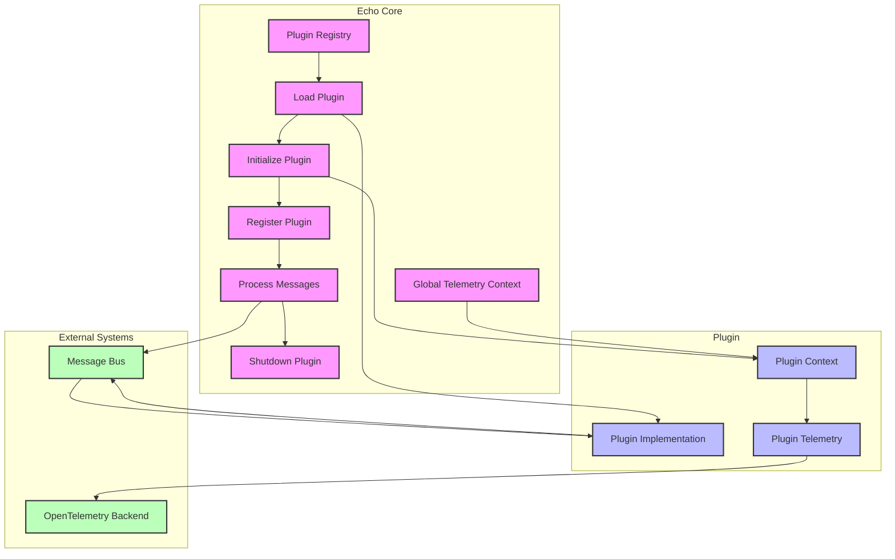

# Echo Core Plugin System

This directory contains the Echo Core plugin system, which allows for extending the functionality of the Echo Core platform through plugins.

## Directory Structure

- `workshop/`: Contains the source code for plugins under development
- `libraries/`: Contains built plugin libraries and manifests
  - `development/`: Development builds of plugins
  - `production/`: Production builds of plugins
- `scripts/`: Contains scripts for managing plugins

## Plugin Lifecycle and Telemetry Integration

The Echo Core plugin system includes comprehensive telemetry integration using OpenTelemetry. Below is a diagram illustrating the full lifecycle of a plugin, including registration, message processing, and telemetry flow:



### Plugin Lifecycle Phases

1. **Registration**: The Plugin Registry loads the plugin from a dynamic library and creates an instance.
2. **Initialization**: The plugin is initialized with a `PluginContext` that includes:
   - A reference to the message transport
   - Plugin configuration
   - A reference to the telemetry context
3. **Message Processing**: The plugin processes messages from subscribed topics and publishes results.
4. **Telemetry Reporting**: Throughout its lifecycle, the plugin reports telemetry data directly to the OpenTelemetry backend.
5. **Shutdown**: When the core system shuts down or the plugin is deactivated, the plugin's shutdown method is called.

### Telemetry Flow

The telemetry integration follows this pattern:

1. **Initialization**: When a plugin is registered or loaded, the core passes a reference to the `TelemetryContext` to the plugin via the `PluginContext`.

2. **Direct Reporting**: Once initialized, the plugin uses this reference to send telemetry data (spans, metrics, etc.) directly to the telemetry backend through the `common-telemetry` crate, without routing back through the core.

3. **Fallback Mechanism**: If for some reason the direct telemetry context isn't available, the plugin can fall back to using the global telemetry context from the core.

### Standard Telemetry Attributes

The following standard attributes are automatically added to all telemetry operations:

| Attribute | Description | Example |
|-----------|-------------|---------|
| `plugin.name` | Name of the plugin | `"validator"` |
| `plugin.version` | Version of the plugin | `"1.0.0"` |
| `plugin.status` | Current status of the plugin | `"active"` |
| `message.topic` | Topic of the message being processed | `"transcript.raw"` |
| `message.id` | ID of the message being processed | `"123e4567-e89b-12d3-a456-426614174000"` |

These attributes are automatically added by the `PluginContext` to all telemetry operations, ensuring consistent correlation across spans and metrics.

### Telemetry for Plugin Lifecycle Events

The plugin system records telemetry for key lifecycle events:

| Event | Metric/Span | Attributes |
|-------|-------------|------------|
| Initialization | `plugin.init.duration_ms` | `plugin.name`, `plugin.version` |
| Shutdown | `plugin.shutdown.duration_ms` | `plugin.name`, `plugin.version` |
| Health Check | `plugin.lifecycle.events` | `plugin.name`, `event=health_check`, `result` |
| Message Processing | `plugin.message.processing_time_ms` | `plugin.name`, `message.topic`, `message.id` |

### Benefits of Direct Telemetry Reporting

1. **Performance**: Direct reporting eliminates an extra hop through the core, reducing latency for telemetry operations.

2. **Reduced Coupling**: Plugins don't need to call back to the core for telemetry operations, reducing interdependencies.

3. **Simplified Implementation**: The plugin code can use the telemetry context directly with a clean API, making telemetry integration more straightforward.

4. **Consistent Configuration**: All plugins use the same telemetry configuration (exporters, sampling, etc.) since they share the same telemetry context instance.

### Correlation Between Plugins

Plugins can correlate their telemetry data with other plugins by including message IDs in their spans and metrics. When a plugin processes a message and creates a new one, it should:

1. Include the original message ID in the receipt
2. Record the message ID in telemetry spans and metrics

This allows the observability platform (e.g., Grafana/Tempo) to correlate spans across plugins based on the message IDs, creating a complete trace of the message flow through the system.

## Plugin Management Scripts

The following scripts are available for managing plugins:

### Create a New Plugin

```bash
./scripts/create_plugin.sh <plugin_name> [plugin_type]
```

Creates a new plugin with the specified name and optional type. The plugin source code will be created in `plugins/workshop/<plugin_name>`.

**Arguments:**

- `plugin_name`: The name of the plugin (required)
- `plugin_type`: The type of plugin (optional): validator, transformer, filter, router, source, sink

**Example:**

```bash
./scripts/create_plugin.sh my_validator validator
```

### Build a Plugin

```bash
./scripts/build_plugin.sh <plugin_name> [build_type]
```

Builds the specified plugin and copies the resulting library and manifest to the libraries directory.

**Arguments:**

- `plugin_name`: The name of the plugin to build (required)
- `build_type`: The type of build (optional): development (default) or production

**Example:**

```bash
./scripts/build_plugin.sh my_validator production
```

### Activate/Deactivate a Plugin

```bash
./scripts/activate_plugin.sh <action> <plugin_name> [build_type]
```

Activates or deactivates a plugin by creating or removing symlinks in the `core/plugins/enabled` directory.

**Arguments:**

- `action`: The action to perform (required): activate or deactivate
- `plugin_name`: The name of the plugin (required)
- `build_type`: The type of build to activate (required for activation): development or production

**Examples:**

```bash
./scripts/activate_plugin.sh activate my_validator development
./scripts/activate_plugin.sh deactivate my_validator
```

### List Plugins

```bash
./scripts/list_plugins.sh [build_type]
```

Lists all available and activated plugins.

**Arguments:**

- `build_type`: The type of build to list (optional): all (default), development, or production

**Example:**

```bash
./scripts/list_plugins.sh development
```

## Plugin Development

### Plugin Structure

A plugin consists of:

1. A Rust library that implements the `Plugin` trait from the Echo Core API
2. A manifest file (`manifest.json`) that describes the plugin

### Plugin Manifest

The manifest file (`manifest.json`) contains metadata about the plugin, including:

- `name`: The name of the plugin
- `version`: The version of the plugin
- `description`: A description of the plugin
- `entry_point`: The name of the function that creates the plugin instance
- `subscriptions`: A list of topics the plugin subscribes to
- `publications`: A list of topics the plugin publishes to
- `config`: Configuration options for the plugin

Example manifest:

```json
{
  "name": "my_validator",
  "version": "0.1.0",
  "description": "A validator plugin for Echo Core",
  "entry_point": "create_plugin",
  "subscriptions": ["#"],
  "publications": [
    "plugin.my_validator.output"
  ],
  "config": {
    "option1": "default_value",
    "option2": 123
  }
}
```

### Plugin Implementation with Telemetry

A plugin must implement the `Plugin` trait from the Echo Core API. Here's an example that includes telemetry integration:

```rust
use async_trait::async_trait;
use echo_core::{
    messaging::BaseMessage,
    plugin::{Plugin, PluginContext, PluginError, ProcessingStatus},
};
use std::collections::HashMap;

pub struct MyPlugin {
    name: String,
}

impl MyPlugin {
    pub fn new(name: &str) -> Self {
        Self {
            name: name.to_string(),
        }
    }
}

#[async_trait]
impl Plugin for MyPlugin {
    fn name(&self) -> &str {
        &self.name
    }

    async fn init(&self, context: PluginContext) -> Result<(), PluginError> {
        // Record initialization in telemetry
        context.record_counter("plugin.init.count", 1, None);
        
        // Create a span for initialization
        let mut attrs = HashMap::new();
        attrs.insert("plugin.name".to_string(), self.name.clone());
        
        if let Some(span) = context.create_span("plugin_initialization", Some(attrs)) {
            // The span will automatically end when dropped at the end of this scope
            context.logger().info("Plugin initialized successfully", None);
        }
        
        Ok(())
    }

    async fn process_message(
        &self, 
        topic: &str, 
        message: &BaseMessage
    ) -> Result<ProcessingStatus, PluginError> {
        // Create attributes for telemetry
        let mut attrs = HashMap::new();
        attrs.insert("topic".to_string(), topic.to_string());
        attrs.insert("message.id".to_string(), message.id.to_string());
        
        // Create a span for message processing
        let span_option = context.create_span("process_message", Some(attrs.clone()));
        
        // Record message received metric
        context.record_counter("plugin.messages.received", 1, Some(attrs.clone()));
        
        // Process the message (timing the operation)
        let start = std::time::Instant::now();
        
        // Your message processing logic here
        
        let duration_ms = start.elapsed().as_millis() as f64;
        
        // Record processing duration
        context.record_histogram("plugin.message.processing_time_ms", duration_ms, Some(attrs));
        
        Ok(ProcessingStatus::Acknowledged)
    }

    async fn shutdown(&self) -> Result<(), PluginError> {
        // Record shutdown in telemetry
        context.record_counter("plugin.shutdown.count", 1, None);
        Ok(())
    }

    async fn health_check(&self) -> bool {
        true
    }
}

// Export the plugin entry point
#[no_mangle]
pub extern "C" fn create_plugin() -> Box<dyn Plugin> {
    Box::new(MyPlugin::new("my_plugin"))
}
```

## Plugin Types

The Echo Core system supports various types of plugins:

- **Validator**: Validates messages before they are processed
- **Transformer**: Transforms messages from one format to another
- **Filter**: Filters messages based on certain criteria
- **Router**: Routes messages to different destinations
- **Source**: Generates messages from external sources
- **Sink**: Sends messages to external destinations

Each plugin type has a specific role in the Echo Core message processing pipeline.

## Example Plugins

The following example plugins are available to help you understand how to implement plugins for Echo Core:

### Telemetry Example Plugin

Located in `plugins/workshop/telemetry_example`, this plugin demonstrates how to use the telemetry integration in Echo Core plugins. It shows:

- How to create spans for operations
- How to record metrics (counters, gauges, histograms)
- How to use message context in telemetry
- How to add custom attributes to telemetry operations

See the [Telemetry Example Plugin README](workshop/telemetry_example/README.md) for more details.
