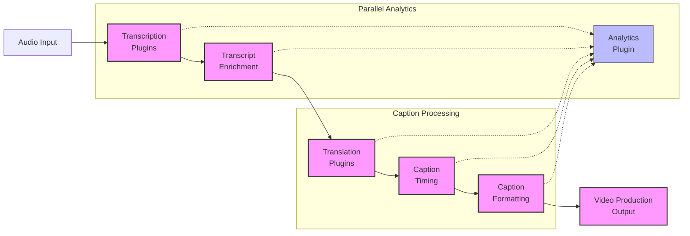
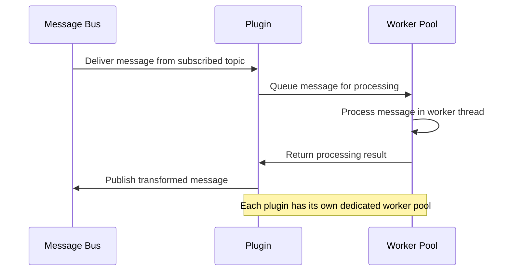
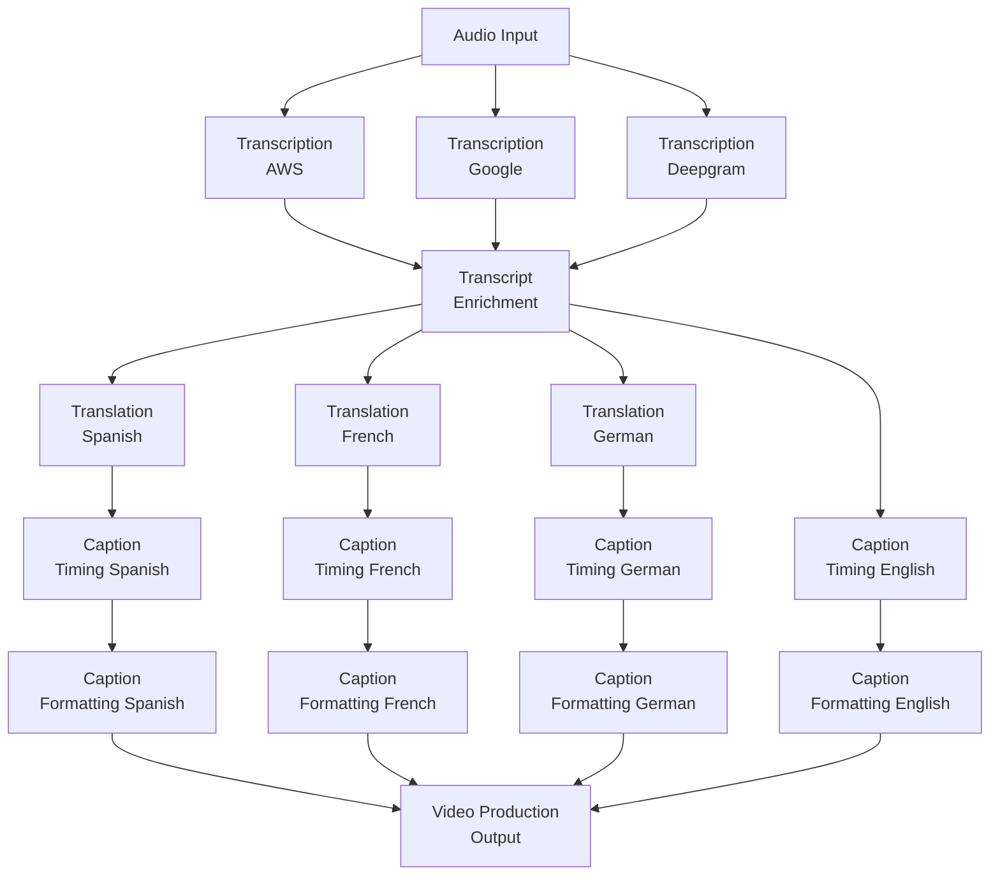

# Plugin Processing Pipeline

This document provides a comprehensive overview of Echo Core's plugin processing pipeline, focusing on the transcription-to-production workflow that processes spoken audio into video-ready captions.

## Table of Contents

- [Plugin Processing Pipeline](#plugin-processing-pipeline)
  - [Table of Contents](#table-of-contents)
  - [1. Pipeline Overview](#1-pipeline-overview)
    - [1.1 Core Processing Flow](#11-core-processing-flow)
    - [1.2 Message Transformation Chain](#12-message-transformation-chain)
    - [1.3 Pipeline Design Principles](#13-pipeline-design-principles)
  - [2. Plugin Workflow Architecture](#2-plugin-workflow-architecture)
    - [2.1 Standard Plugin Processing Chain](#21-standard-plugin-processing-chain)
    - [2.2 Parallel Processing Capabilities](#22-parallel-processing-capabilities)
    - [2.3 Worker Pool Implementation](#23-worker-pool-implementation)
  - [3. Topic Naming Conventions](#3-topic-naming-conventions)
    - [3.1 Hierarchical Topic Structure](#31-hierarchical-topic-structure)
    - [3.2 Example Topic Paths](#32-example-topic-paths)
    - [3.3 Topic Design Considerations](#33-topic-design-considerations)
  - [4. Plugin Components](#4-plugin-components)
    - [4.1 Transcription Plugins](#41-transcription-plugins)
    - [4.2 Transcript Enrichment Plugin](#42-transcript-enrichment-plugin)
    - [4.3 Translation Plugins](#43-translation-plugins)
    - [4.4 Caption Timing Plugin](#44-caption-timing-plugin)
    - [4.5 Caption Formatting Plugin](#45-caption-formatting-plugin)
    - [4.6 Video Production Output Plugin](#46-video-production-output-plugin)
    - [4.7 Analytics Plugin](#47-analytics-plugin)
  - [5. Message Flow Implementation](#5-message-flow-implementation)
    - [5.1 Thread Safety and Ownership](#51-thread-safety-and-ownership)
    - [5.2 Message Transformation Patterns](#52-message-transformation-patterns)
    - [5.3 State Transitions as Type Transformations](#53-state-transitions-as-type-transformations)
  - [6. Example Code Implementations](#6-example-code-implementations)
    - [6.1 Plugin Implementation Template](#61-plugin-implementation-template)
    - [6.2 Message Handling Code](#62-message-handling-code)
    - [6.3 Topic Subscription Example](#63-topic-subscription-example)
  - [7. Performance Considerations](#7-performance-considerations)
    - [7.1 Latency Requirements](#71-latency-requirements)
    - [7.2 Throughput Optimization](#72-throughput-optimization)
    - [7.3 Resource Scaling Strategies](#73-resource-scaling-strategies)

## 1. Pipeline Overview

### 1.1 Core Processing Flow

The Echo Core plugin system implements a streaming pipeline architecture designed to transform audio input into synchronized captions with minimal latency. The pipeline consists of multiple specialized plugins, each focused on a specific aspect of the transformation process.



### 1.2 Message Transformation Chain

Each plugin in the pipeline performs a specific transformation on the incoming message and publishes the result to the message bus. The published message becomes available to downstream plugins subscribed to the corresponding topic.

1. **Audio → Transcription**: Raw audio is processed by transcription services to produce text
2. **Transcription → Enrichment**: Raw transcripts are enhanced with punctuation, capitalization, etc.
3. **Enrichment → Translation**: Enhanced transcripts are translated to other languages
4. **Translation → Caption Timing**: Transcripts/translations are aligned with audio timing
5. **Caption Timing → Caption Formatting**: Timed captions are formatted for display
6. **Caption Formatting → Video Production**: Formatted captions are prepared for inclusion in video streams

### 1.3 Pipeline Design Principles

The plugin processing pipeline embodies several key design principles:

1. **Separation of Concerns**: Each plugin handles a single, well-defined responsibility
2. **Independent Scaling**: Plugins can be scaled independently based on processing needs
3. **Fault Isolation**: Failures in one plugin don't affect others
4. **Low Latency**: The pipeline is optimized for minimal end-to-end latency
5. **Flexibility**: Multiple plugin instances can run in parallel, using different providers or configurations
6. **Stateless Processing**: Plugins operate on individual messages without maintaining state
7. **Message Immutability**: Messages are treated as immutable, with transformations creating new messages

## 2. Plugin Workflow Architecture

### 2.1 Standard Plugin Processing Chain

The standard plugin processing workflow follows this pattern:



### 2.2 Parallel Processing Capabilities

The system supports multiple parallel processing paths:

1. **Provider Redundancy**: Multiple transcription providers can process the same audio simultaneously
2. **Language Parallelism**: Multiple translation plugins can process different target languages
3. **A/B Testing**: Different configurations of the same plugin type can run simultaneously
4. **Worker Parallelism**: Each plugin has multiple workers processing messages concurrently



### 2.3 Worker Pool Implementation

Each plugin has its own dedicated worker pool that manages concurrent message processing:

1. **Adaptive Scaling**: Worker pools can scale up or down based on load
2. **Backpressure Handling**: Worker pools implement backpressure mechanisms to prevent overload
3. **Task Prioritization**: Critical messages can be prioritized over less time-sensitive ones
4. **Resource Isolation**: Each plugin's workers operate independently of others

```rust
// Example WorkerPool usage within a plugin
struct MyPlugin {
    name: String,
    context: Arc<PluginContext>,
    worker_pool: Arc<WorkerPool>,
}

impl MyPlugin {
    fn new(context: Arc<PluginContext>) -> Self {
        let pool_config = WorkerPoolConfig {
            min_workers: 2,
            max_workers: 8,
            queue_size: 100,
            spawn_threshold: 0.7, // Spawn new worker when pool is 70% utilized
            timeout: Duration::from_secs(30),
        };
        
        Self {
            name: "my_plugin".to_string(),
            context: context.clone(),
            worker_pool: Arc::new(WorkerPool::new("my_plugin", pool_config, context)),
        }
    }
    
    async fn process_message(&self, topic: &str, message: &BaseMessage) -> Result<(), PluginError> {
        // Submit task to worker pool
        self.worker_pool.submit(async move {
            // Message processing logic
            // ...
            
            // Publish result to output topic
            let result = // ... transformed message
            self.context.transport.publish("output.topic", &result).await?;
            
            Ok(())
        }).await
    }
}
```

## 3. Topic Naming Conventions

### 3.1 Hierarchical Topic Structure

Topic names follow a hierarchical structure to organize the message flow:

```plaintext
<category>.<provider|source>.<subcategory>.<optional_qualifier>
```

- **category**: Primary classification (audio, transcript, captions, etc.)
- **provider|source**: Origin or processing entity (aws, google, deepgram, etc.)
- **subcategory**: Further classification (raw, enhanced, translated, etc.)
- **optional_qualifier**: Additional details (language code, format type, etc.)

### 3.2 Example Topic Paths

The standard message flow follows these topic paths:

```plaintext
audio.raw                                 # Raw audio input
↓
transcript.[provider].raw                 # Raw transcription from provider
↓
transcript.[provider].enhanced            # Enhanced transcript with corrections
↓
transcript.[provider].[language]          # Translated transcript
↓
captions.[language].timed                 # Timed captions
↓
captions.[language].formatted             # Formatted captions
↓
production.captions.[format]              # Production-ready captions
```

Specific examples:

- `audio.raw` - Raw audio data
- `transcript.aws.raw` - Raw transcript from AWS
- `transcript.deepgram.enhanced` - Enhanced Deepgram transcript
- `transcript.google.es` - Spanish translation of Google transcript
- `captions.en.timed` - English captions with timing information
- `captions.fr.formatted` - Formatted French captions
- `production.captions.cea608` - CEA-608 formatted captions for production

### 3.3 Topic Design Considerations

The topic naming conventions are designed with these considerations:

1. **Discoverability**: Related topics have similar prefixes
2. **Filtering**: Easy topic filtering with wildcards (e.g., `transcript.*`)
3. **Clarity**: Topic names clearly indicate the message content
4. **Consistency**: Uniform structure across all message types
5. **Extensibility**: New providers or languages can be added without changing the structure

## 4. Plugin Components

### 4.1 Transcription Plugins

**Purpose**: Convert raw audio into text transcripts

**Input**: `audio.raw`  
**Output**: `transcript.[provider].raw`

**Key Features**:

- Interface with external transcription APIs
- Handle different audio formats and sampling rates
- Implement retry logic for transient failures
- Output standardized transcription messages

**Implementation Notes**:

- Each provider (AWS, Google, Deepgram, etc.) has its own plugin implementation
- All implementations use the same output message format
- Plugins add provider-specific metadata to output messages
- Word-level timing information is included when available

### 4.2 Transcript Enrichment Plugin

**Purpose**: Enhance raw transcripts with corrections, punctuation, and other improvements

**Input**: `transcript.[provider].raw`  
**Output**: `transcript.[provider].enhanced`

**Key Features**:

- Sentence boundary detection
- Punctuation and capitalization
- Common error correction
- Text normalization (numbers, dates, etc.)

**Implementation Notes**:

- May use machine learning models for enhanced accuracy
- Preserves original timing information
- Can merge multiple transcription sources for improved accuracy
- Provides confidence scores for corrections

### 4.3 Translation Plugins

**Purpose**: Translate enhanced transcripts into multiple languages

**Input**: `transcript.[provider].enhanced`  
**Output**: `transcript.[provider].[language]`

**Key Features**:

- Integration with translation services
- Language-specific handling
- Preserve timing alignment where possible
- Handle cultural adaptations

**Implementation Notes**:

- Multiple instances run in parallel for different target languages
- Each instance is configured for a specific language pair
- Messages include both source and target language information
- Alignment information helps with synchronization downstream

### 4.4 Caption Timing Plugin

**Purpose**: Process transcripts/translations into properly timed caption segments

**Input**: `transcript.[provider].[language]` or `transcript.[provider].enhanced`  
**Output**: `captions.[language].timed`

**Key Features**:

- Word-level synchronization
- Optimal caption breaking
- Reading speed considerations
- Start/end time calculations

**Implementation Notes**:

- CPU-intensive operations (timing calculations)
- Multiple instances can run in parallel for different languages
- Implements sophisticated timing algorithms
- Considers reading speed and cognitive load

### 4.5 Caption Formatting Plugin

**Purpose**: Apply visual formatting to timed captions for optimal display

**Input**: `captions.[language].timed`  
**Output**: `captions.[language].formatted`

**Key Features**:

- Position and alignment
- Font and style selection
- Color and emphasis
- Background/contrast handling

**Implementation Notes**:

- More I/O bound than CPU bound
- Each language may have different formatting requirements
- Implements standard caption formatting best practices
- Supports multiple output formats (CEA-608/708, WebVTT, etc.)

### 4.6 Video Production Output Plugin

**Purpose**: Prepare captions for inclusion in video streams

**Input**: `captions.[language].formatted`  
**Output**: `production.captions.[format]`

**Key Features**:

- Format conversion for production systems
- Timing adjustment for broadcast delays
- Multi-language packaging
- Compliance with broadcast standards

**Implementation Notes**:

- Implements industry-standard output formats
- Focuses on interoperability with production systems
- Handles format-specific constraints and features
- May integrate directly with broadcast equipment

### 4.7 Analytics Plugin

**Purpose**: Provide cross-cutting analysis of the entire pipeline

**Input**: Multiple topics (subscribes to all relevant topics)  
**Output**: `analytics.metrics`, `analytics.insights`, etc.

**Key Features**:

- End-to-end latency tracking
- Quality correlation analysis
- Language and content patterns
- System performance monitoring

**Implementation Notes**:

- Non-blocking design (doesn't affect the critical path)
- Uses Rust's Stream composition for parallel analysis
- Implements sophisticated data correlation
- Provides both real-time and historical analysis

## 5. Message Flow Implementation

### 5.1 Thread Safety and Ownership

The message flow leverages Rust's ownership model to ensure thread safety:

1. **Message Ownership Transfer**: When a plugin publishes a message, it transfers ownership to the message bus
2. **Arc for Shared Access**: When multiple components need access, `Arc` (Atomic Reference Counting) is used
3. **Send + Sync Traits**: All plugins and messages implement `Send + Sync` for thread safety
4. **Worker Pool Isolation**: Each plugin's worker pool operates independently

```rust
// Example of ownership transfer in message handling
async fn process_message(&self, topic: &str, message: &BaseMessage) -> Result<BaseMessage, PluginError> {
    // Process the message (creating a new message, not modifying the original)
    let mut result = self.context.message_builder()
        .with_data(process_data(&message.data)?)
        .with_schema(message.schema.clone())
        .build();
        
    // Once published, the message is owned by the transport
    self.context.transport.publish("output.topic", &result).await?;
    
    // Return the result (the caller can choose to use it or not)
    Ok(result)
}
```

### 5.2 Message Transformation Patterns

Messages follow a transformation pattern where each step produces a new message:

1. **Immutable Input**: Input messages are treated as immutable
2. **Builder Pattern**: New messages are created using a builder pattern
3. **Context Propagation**: Metadata and trace context are propagated
4. **Type Safety**: Message structures enforce proper data flow

```rust
// Example message transformation
async fn enhance_transcript(&self, message: &BaseMessage) -> Result<BaseMessage, PluginError> {
    // Extract the transcript data
    let transcript = serde_json::from_value::<RawTranscript>(message.data.clone())?;
    
    // Enhance the transcript
    let enhanced = self.enhancer.process(transcript)?;
    
    // Create a new message with the enhanced data
    let result = self.context.message_builder()
        .with_data(serde_json::to_value(enhanced)?)
        .with_source(format!("{}.enhancer", self.name()))
        .with_trace_context(message.trace_context.clone())
        .build();
        
    Ok(result)
}
```

### 5.3 State Transitions as Type Transformations

The plugin pipeline uses Rust's type system to enforce correct state transitions, similar to the state pattern shown in the Rust documentation:

```rust
// State transitions enforced through the type system
pub struct RawTranscript {
    text: String,
    words: Vec<TranscriptWord>,
    provider: String,
    // Other fields...
}

pub struct EnhancedTranscript {
    text: String,
    sentences: Vec<TranscriptSentence>,
    words: Vec<TranscriptWord>,
    provider: String,
    // Other fields...
}

impl RawTranscript {
    // Transform to enhanced transcript (consumes self)
    pub fn enhance(self, enhancer: &Enhancer) -> Result<EnhancedTranscript, EnhancementError> {
        // Enhancement logic...
        // Returns a new EnhancedTranscript
    }
}

impl EnhancedTranscript {
    // Transform to translated transcript (consumes self)
    pub fn translate(self, translator: &Translator, target_lang: &str) -> Result<TranslatedTranscript, TranslationError> {
        // Translation logic...
        // Returns a new TranslatedTranscript
    }
}
```

This pattern ensures that operations are performed in the correct sequence and prevents invalid state transitions.

## 6. Example Code Implementations

### 6.1 Plugin Implementation Template

```rust
use std::sync::Arc;
use async_trait::async_trait;
use serde_json::json;

pub struct ExamplePlugin {
    name: String,
    context: Arc<PluginContext>,
    config: ExampleConfig,
    worker_pool: Arc<WorkerPool>,
    state: Arc<RwLock<PluginState>>,
}

struct PluginState {
    initialized: bool,
    processed_count: usize,
}

#[async_trait]
impl Plugin for ExamplePlugin {
    fn name(&self) -> &str {
        &self.name
    }
    
    async fn init(&self) -> Result<(), PluginError> {
        // Subscribe to input topics
        self.context.transport.subscribe("input.topic").await?;
        
        // Initialize resources
        // ...
        
        // Set state to initialized
        let mut state = self.state.write().await;
        state.initialized = true;
        
        Ok(())
    }
    
    async fn process_message(&self, topic: &str, message: &BaseMessage) -> Result<BaseMessage, PluginError> {
        // Process based on topic
        match topic {
            "input.topic" => self.handle_input(message).await,
            _ => Err(PluginError::NotFound(format!("Unsupported topic: {}", topic))),
        }
    }
    
    async fn shutdown(&self) -> Result<(), PluginError> {
        // Clean up resources
        // ...
        
        // Unsubscribe from topics
        self.context.transport.unsubscribe("input.topic").await?;
        
        Ok(())
    }
    
    async fn health_check(&self) -> bool {
        // Check plugin health
        self.state.read().await.initialized
    }
}

impl ExamplePlugin {
    pub fn new(context: Arc<PluginContext>, config: ExampleConfig) -> Self {
        let pool_config = WorkerPoolConfig {
            min_workers: config.min_workers,
            max_workers: config.max_workers,
            queue_size: config.queue_size,
            spawn_threshold: 0.7,
            timeout: Duration::from_secs(30),
        };
        
        Self {
            name: "example_plugin".to_string(),
            context: context.clone(),
            config,
            worker_pool: Arc::new(WorkerPool::new("example_plugin", pool_config, context.clone())),
            state: Arc::new(RwLock::new(PluginState {
                initialized: false,
                processed_count: 0,
            })),
        }
    }
    
    async fn handle_input(&self, message: &BaseMessage) -> Result<BaseMessage, PluginError> {
        // Extract data from message
        let input_data = serde_json::from_value::<InputData>(message.data.clone())?;
        
        // Process the data
        let output_data = self.process_data(input_data).await?;
        
        // Create result message
        let result = self.context.message_builder()
            .with_data(serde_json::to_value(output_data)?)
            .with_source(format!("{}.processor", self.name()))
            .with_trace_context(message.trace_context.clone())
            .build();
            
        // Update metrics
        {
            let mut state = self.state.write().await;
            state.processed_count += 1;
        }
        
        // Return the result
        Ok(result)
    }
    
    async fn process_data(&self, input: InputData) -> Result<OutputData, PluginError> {
        // Submit to worker pool for processing
        self.worker_pool.submit(async move {
            // Processing logic
            // ...
            
            Ok(OutputData {
                // Output fields
            })
        }).await
    }
}
```

### 6.2 Message Handling Code

```rust
// Example message handling for Caption Timing Plugin
async fn process_transcript(&self, message: &BaseMessage) -> Result<BaseMessage, PluginError> {
    // Create a span for telemetry
    let span = self.context.create_span("process_transcript", Some(HashMap::from([
        ("transcript_id".to_string(), message.id.to_string()),
        ("language".to_string(), self.config.language.clone()),
    ])));
    let _guard = span.as_ref().map(|s| s);
    
    // Extract transcript data
    let transcript = match serde_json::from_value::<EnhancedTranscript>(message.data.clone()) {
        Ok(t) => t,
        Err(e) => {
            self.context.record_counter("caption.errors", 1, Some(HashMap::from([
                ("error_type".to_string(), "deserialization".to_string()),
                ("error".to_string(), e.to_string()),
            ])));
            return Err(PluginError::Deserialization(e.to_string()));
        }
    };
    
    // Compute timing for each word and create caption segments
    let result = self.timing_engine.compute_timing(transcript).await?;
    
    // Create timed caption message
    let timed_captions = TimedCaptions {
        language: self.config.language.clone(),
        segments: result.segments,
        metadata: CaptionMetadata {
            total_duration_ms: result.total_duration_ms,
            segment_count: result.segments.len(),
            word_count: result.word_count,
            average_words_per_minute: result.average_words_per_minute,
        },
    };
    
    // Record metrics
    self.context.record_histogram("caption.timing.duration_ms", result.processing_time_ms as f64, None);
    self.context.record_counter("caption.segments.created", result.segments.len() as u64, None);
    
    // Create output message
    let output = self.context.message_builder()
        .with_data(serde_json::to_value(timed_captions)?)
        .with_source(format!("caption.timing.{}", self.config.language))
        .with_trace_context(message.trace_context.clone())
        .build();
        
    Ok(output)
}
```

### 6.3 Topic Subscription Example

```rust
// Example of subscribing to multiple topics
async fn init(&self) -> Result<(), PluginError> {
    // Subscribe to multiple transcript sources with wildcard
    let mut stream = self.context.transport.subscribe("transcript.*.enhanced").await?;
    
    // Start processing task
    tokio::spawn(async move {
        while let Some(result) = stream.next().await {
            match result {
                Ok((topic, message)) => {
                    // Submit message for processing
                    if let Err(e) = self.process_message(&topic, &message).await {
                        // Handle error
                        self.context.logger().error(&format!("Error processing message: {}", e), None);
                    }
                }
                Err(e) => {
                    // Handle subscription error
                    self.context.logger().error(&format!("Subscription error: {}", e), None);
                }
            }
        }
    });
    
    Ok(())
}
```

## 7. Performance Considerations

### 7.1 Latency Requirements

The pipeline is designed to meet a target end-to-end latency of 750ms from when a word is spoken to when it appears on screen:

1. **Audio Capture**: 100ms (buffering and transmission)
2. **Transcription**: 300ms (speech-to-text processing)
3. **Enrichment & Translation**: 150ms (enhancements and translations)
4. **Caption Processing**: 100ms (timing and formatting)
5. **Transport & Display**: 100ms (message transport and rendering)

Key strategies for meeting this latency target:

1. **Early Word Dispatch**: Words are dispatched as soon as they're recognized
2. **Parallel Processing**: Multiple workers process messages concurrently
3. **Zero-Copy Design**: Minimizing memory allocations in the critical path
4. **Immutable Messages**: Preventing expensive locking and synchronization
5. **Microsecond Precision**: Using high-resolution timers for accurate synchronization

### 7.2 Throughput Optimization

Strategies for optimizing throughput:

1. **Worker Pool Scaling**: Dynamically adjust worker count based on load
2. **Batch Processing**: Process multiple messages in a single operation where possible
3. **Message Compression**: Optimize message size for network transport
4. **Channel Capacity Tuning**: Configure channel capacities based on message patterns
5. **Topic-Specific Optimization**: Apply different optimizations based on topic characteristics

### 7.3 Resource Scaling Strategies

Approaches for scaling resources:

1. **Horizontal Scaling**: Run multiple instances of the same plugin
2. **Vertical Scaling**: Increase resources allocated to a single plugin
3. **Dynamic Worker Allocation**: Adjust worker count based on load
4. **Priority-Based Scheduling**: Prioritize critical path operations
5. **Load Shedding**: Drop or delay non-critical messages under extreme load

```rust
// Example of adaptive worker pool scaling
fn adjust_workers(&self, metrics: &WorkerPoolMetrics) {
    let current = metrics.active_workers;
    let queued = metrics.queued_tasks;
    let capacity = metrics.max_workers;
    
    // Scale up if queue is filling up
    if queued > current * 2 && current < capacity {
        self.worker_pool.scale_up(1);
        self.context.logger().info(&format!(
            "Scaled up worker pool to {} workers due to queue depth {}", 
            current + 1, 
            queued
        ), None);
    }
    
    // Scale down if workers are idle
    if queued == 0 && current > self.config.min_workers {
        self.worker_pool.scale_down(1);
        self.context.logger().info(&format!(
            "Scaled down worker pool to {} workers due to idle workers", 
            current - 1
        ), None);
    }
}
```

---

This document provides a comprehensive overview of the plugin processing pipeline in Echo Core. Additional documentation covers specific aspects of the pipeline in more detail, including message schemas, plugin implementation, and optimization strategies.
