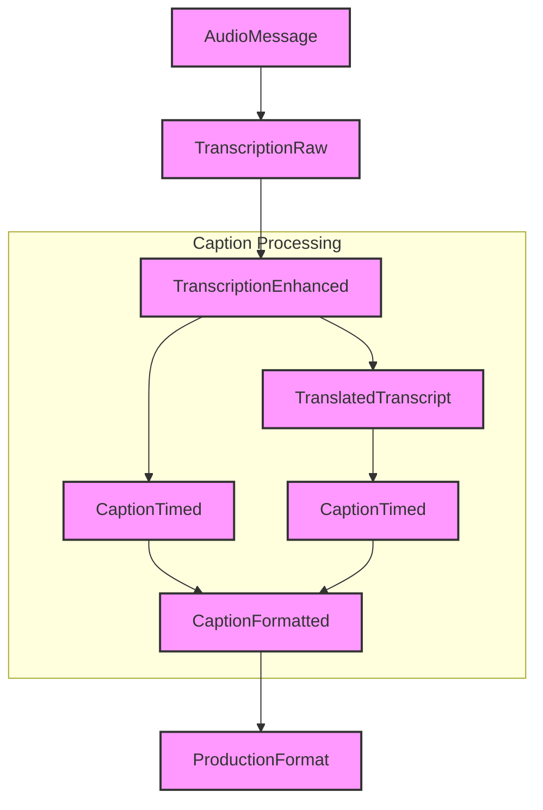

# Message Schema Design

This document details the message schema design for Echo Core's transcription pipeline, focusing on optimized data structures for real-time speech-to-caption processing with ultra-low latency.

## Table of Contents

- [Message Schema Design](#message-schema-design)
  - [Table of Contents](#table-of-contents)
  - [1. Message Schema Overview](#1-message-schema-overview)
    - [1.1 Design Goals](#11-design-goals)
    - [1.2 Message Transformation Flow](#12-message-transformation-flow)
    - [1.3 Schema Evolution Strategy](#13-schema-evolution-strategy)
  - [2. Core Message Types](#2-core-message-types)
    - [2.1 BaseMessage](#21-basemessage)
    - [2.2 Audio Messages](#22-audio-messages)
    - [2.3 Transcription Messages](#23-transcription-messages)
    - [2.4 Caption Messages](#24-caption-messages)
  - [3. Transcription Message Design](#3-transcription-message-design)
    - [3.1 Optimizing for Low Latency](#31-optimizing-for-low-latency)
    - [3.2 UUIDv7 for Embedded Timestamps](#32-uuidv7-for-embedded-timestamps)
    - [3.3 Bit Flags for Message Type](#33-bit-flags-for-message-type)
    - [3.4 Hierarchical Message Structure](#34-hierarchical-message-structure)
  - [4. Schema Implementation](#4-schema-implementation)
    - [4.1 TranscriptionUnit](#41-transcriptionunit)
    - [4.2 Caption Timing Structures](#42-caption-timing-structures)
    - [4.3 Type-Driven Transformations](#43-type-driven-transformations)
  - [5. Industry Compatibility](#5-industry-compatibility)
    - [5.1 SMPTE 2110 Integration](#51-smpte-2110-integration)
    - [5.2 CEA-608/708 Support](#52-cea-608708-support)
    - [5.3 WebVTT and Other Web Formats](#53-webvtt-and-other-web-formats)
  - [6. Optimization Techniques](#6-optimization-techniques)
    - [6.1 Zero-Copy Processing](#61-zero-copy-processing)
    - [6.2 Message Compression](#62-message-compression)
    - [6.3 Early Dispatch](#63-early-dispatch)
    - [6.4 Predictive Processing](#64-predictive-processing)
  - [7. Rust Implementation Patterns](#7-rust-implementation-patterns)
    - [7.1 Builder Pattern](#71-builder-pattern)
    - [7.2 Type State Pattern](#72-type-state-pattern)
    - [7.3 Ownership and Message Flow](#73-ownership-and-message-flow)

## 1. Message Schema Overview

### 1.1 Design Goals

The message schema design for Echo Core's transcription pipeline is driven by the following key goals:

1. **Ultra-Low Latency**: Achieve end-to-end latency of 750ms from spoken word to on-screen display
2. **Type Safety**: Use Rust's type system to enforce correct message handling
3. **Minimal Allocation**: Reduce memory allocations in the critical path
4. **Standards Compatibility**: Support industry standards while meeting latency requirements
5. **Efficient Serialization**: Fast encoding/decoding with minimal overhead
6. **Clear State Transitions**: Enforce correct processing order through types
7. **Extensibility**: Allow for future enhancements without breaking changes

### 1.2 Message Transformation Flow



Each message type represents a distinct state in the processing pipeline, with well-defined transformations between states. This ensures type safety and prevents invalid operations.

### 1.3 Schema Evolution Strategy

The message schema is designed to evolve over time while maintaining backward compatibility:

1. **Version Field**: All messages include a version field to track schema changes
2. **Optional Fields**: New fields are added as optional to maintain compatibility
3. **Feature Flags**: Capability negotiation through feature flags
4. **Semantic Versioning**: Schema changes follow semantic versioning principles
5. **Migration Path**: Clear migration path for consuming systems

## 2. Core Message Types

### 2.1 BaseMessage

All messages in the system extend the `BaseMessage` structure, which provides common fields for routing, identification, and tracing:

```rust
pub struct BaseMessage {
    pub id: Uuid,                         // UUIDv7 with embedded timestamp
    pub timestamp: DateTime<Utc>,         // Message creation time
    pub source: String,                   // Source identifier
    pub version: String,                  // Schema version
    pub data: Value,                      // Message payload (JSON)
    pub schema: Option<SchemaInfo>,       // Optional schema information
    pub trace_context: Option<TraceContext>, // OpenTelemetry context
}
```

The `BaseMessage` serves as an envelope for all typed message payloads, with the actual message content serialized in the `data` field.

### 2.2 Audio Messages

Audio messages contain the raw audio data or references to audio sources:

```rust
pub struct AudioMessage {
    pub audio_data: Vec<u8>,              // Raw audio bytes
    pub format: AudioFormat,              // Audio format details
    pub duration_ms: u32,                 // Duration in milliseconds
    pub sample_rate: u32,                 // Sample rate in Hz
    pub channels: u8,                     // Number of audio channels
    pub timestamp_us: u64,                // Capture timestamp (microseconds)
}

pub enum AudioFormat {
    Raw {
        encoding: AudioEncoding,
        bit_depth: u8,
    },
    Compressed {
        codec: String,
        bit_rate: u32,
    },
    Reference {
        uri: String,
        content_type: String,
    },
}
```

Audio messages are typically published to the `audio.raw` topic and consumed by transcription plugins.

### 2.3 Transcription Messages

Transcription messages represent the core output of speech-to-text processing and form the foundation of the caption generation pipeline. The transcription message schema has been optimized for real-time, low-latency processing:

```rust
#[derive(Debug, Clone, Serialize, Deserialize)]
pub struct TranscriptionUnit {
    // Core fields (always present, optimized for latency)
    pub id: Uuid,                     // UUIDv7 (with embedded timestamp)
    pub text: String,                 // The text content
    pub start_us: u64,                // Start time in microseconds
    pub duration_us: u32,             // Duration in microseconds
    pub flags: u8,                    // Bit flags for message properties
    pub seq: u16,                     // Sequence number within segment
    
    // Optional fields for extended functionality
    pub provider_id: Option<u8>,      // Transcription provider identifier
    pub language: Option<String>,     // ISO 639 language code
    pub confidence: Option<f32>,      // Confidence score (0.0-1.0)
    
    // Industry compatibility fields
    pub timecode: Option<u32>,        // SMPTE timecode reference
}
```

The `TranscriptionUnit` structure is designed to be compact while containing all essential information for caption generation.

### 2.4 Caption Messages

Caption messages build upon transcription data and add display formatting and timing information:

```rust
pub struct CaptionTimed {
    pub language: String,             // ISO 639 language code
    pub segments: Vec<CaptionSegment>, // Timed caption segments
    pub metadata: CaptionMetadata,    // Caption metadata
}

pub struct CaptionSegment {
    pub id: Uuid,                     // Segment identifier
    pub text: String,                 // Segment text
    pub start_us: u64,                // Start time in microseconds
    pub duration_us: u32,             // Duration in microseconds
    pub words: Vec<TimedWord>,        // Word-level timing (optional)
    pub speaker: Option<String>,      // Speaker identifier (optional)
}

pub struct CaptionFormatted {
    pub language: String,             // ISO 639 language code
    pub segments: Vec<FormattedSegment>, // Formatted caption segments
    pub format: CaptionFormat,        // Format information
}

pub struct FormattedSegment {
    pub id: Uuid,                     // Segment identifier
    pub text: String,                 // Formatted text (may include markup)
    pub start_us: u64,                // Start time in microseconds
    pub duration_us: u32,             // Duration in microseconds
    pub position: Position,           // Screen position
    pub style: CaptionStyle,          // Visual style
}
```

These message types represent the progression from raw timed captions to fully formatted captions ready for display.

## 3. Transcription Message Design

### 3.1 Optimizing for Low Latency

The transcription message schema is optimized for ultra-low latency with several key strategies:

1. **Compact Representation**: Minimal field set with optional extensions
2. **Word-Level Processing**: Individual words can be processed as soon as recognized
3. **Microsecond Timing**: High-precision timing for accurate synchronization
4. **Direct Field Access**: Flat structure for efficient field access
5. **Immutable Messages**: No mutation after creation for thread safety

To meet the 750ms end-to-end latency target, each component of the pipeline is designed to minimize processing time:

```plaintext
Audio Capture (100ms) → Transcription (300ms) → Enhancement (100ms) → 
Caption Timing (50ms) → Formatting (50ms) → Transport & Display (150ms)
```

### 3.2 UUIDv7 for Embedded Timestamps

The message schema leverages UUIDv7 IDs that embed timestamps directly in the UUID:

```rust
// Example of UUIDv7 creation with millisecond precision
pub fn generate_uuidv7() -> Uuid {
    let timestamp_ms = SystemTime::now()
        .duration_since(SystemTime::UNIX_EPOCH)
        .unwrap()
        .as_millis() as u64;
    
    // UUIDv7 format: first 48 bits are timestamp
    let mut bytes = [0u8; 16];
    bytes[0..6].copy_from_slice(&timestamp_ms.to_be_bytes()[2..8]);
    
    // Add version (7) and variant bits
    bytes[6] = (bytes[6] & 0x0F) | 0x70;
    bytes[8] = (bytes[8] & 0x3F) | 0x80;
    
    // Fill remainder with random bytes
    let mut rng = rand::thread_rng();
    rng.fill(&mut bytes[9..16]);
    
    Uuid::from_bytes(bytes)
}
```

This approach provides several benefits:

- Unique message identification
- Embedded creation timestamp
- Chronological sorting by ID
- Efficient storage (16 bytes)

### 3.3 Bit Flags for Message Type

The transcription message uses bit flags to compactly encode message properties:

```rust
// Bit flags for TranscriptionUnit flags field
pub const FLAG_INTERIM: u8 = 0x01;    // Interim result (may change)
pub const FLAG_FINAL: u8 = 0x02;      // Final result (confirmed)
pub const FLAG_CORRECTION: u8 = 0x04; // Correction to previous message
pub const FLAG_SENTENCE_START: u8 = 0x08; // Start of sentence
pub const FLAG_SENTENCE_END: u8 = 0x10;   // End of sentence
pub const FLAG_PARAGRAPH_START: u8 = 0x20; // Start of paragraph
pub const FLAG_PARAGRAPH_END: u8 = 0x40;   // End of paragraph
pub const FLAG_FORMATTED: u8 = 0x80;       // Contains formatting information
```

This approach allows packing multiple boolean properties into a single byte, reducing message size and improving processing efficiency.

### 3.4 Hierarchical Message Structure

The transcription messages form a hierarchical structure that enables efficient processing:

```plaintext
TranscriptionSegment (sentence/phrase level)
 ├─ TranscriptionUnit (word level)
 │   ├─ ID: UUIDv7
 │   ├─ Text: Word or phrase
 │   ├─ Timing: start_us, duration_us
 │   └─ Properties: flags, sequence
 │
 └─ Multiple TranscriptionUnits in sequence
```

This hierarchical structure allows:

- Individual words to be dispatched as soon as recognized
- Words to be associated with their parent segment
- Efficient processing of related words
- Clear boundaries for caption formatting

## 4. Schema Implementation

### 4.1 TranscriptionUnit

The `TranscriptionUnit` is the core message type for transcription data:

```rust
#[derive(Debug, Clone, Serialize, Deserialize)]
pub struct TranscriptionUnit {
    // Core fields (always present, optimized for latency)
    pub id: Uuid,                     // UUIDv7 (with embedded timestamp)
    pub text: String,                 // The text content
    pub start_us: u64,                // Start time in microseconds
    pub duration_us: u32,             // Duration in microseconds
    pub flags: u8,                    // Bit flags for message properties
    pub seq: u16,                     // Sequence number within segment
    
    // Industry compatibility fields
    pub timecode: Option<u32>,        // SMPTE timecode reference
    pub lang: Option<u16>,            // ISO 639 language code (compact form)
    
    // Hierarchical reference fields
    pub segment_id: Option<u32>,      // Parent segment reference (partial UUID)
    
    // Extended formatting (only if flags indicate formatting present)
    pub format: Option<u16>,          // Packed formatting flags
}

impl TranscriptionUnit {
    // Create a new TranscriptionUnit for a word
    pub fn new_word(text: String, start_us: u64, duration_us: u32, seq: u16) -> Self {
        Self {
            id: generate_uuidv7(),
            text,
            start_us,
            duration_us,
            flags: FLAG_INTERIM,  // Start as interim by default
            seq,
            timecode: None,
            lang: None,
            segment_id: None,
            format: None,
        }
    }
    
    // Mark this unit as final (confirmed)
    pub fn finalize(mut self) -> Self {
        self.flags &= !FLAG_INTERIM;
        self.flags |= FLAG_FINAL;
        self
    }
    
    // Associate with a segment
    pub fn with_segment(mut self, segment_id: Uuid) -> Self {
        // Use just the last 32 bits of the UUID for compact reference
        let bytes = segment_id.as_bytes();
        let segment_ref = u32::from_be_bytes([bytes[12], bytes[13], bytes[14], bytes[15]]);
        self.segment_id = Some(segment_ref);
        self
    }
    
    // Extract timestamp from the ID
    pub fn timestamp_ms(&self) -> u64 {
        let bytes = self.id.as_bytes();
        let mut timestamp_bytes = [0u8; 8];
        timestamp_bytes[2..8].copy_from_slice(&bytes[0..6]);
        u64::from_be_bytes(timestamp_bytes)
    }
}
```

The `TranscriptionUnit` implementation provides methods for creating and manipulating transcription data while maintaining immutability guarantees.

### 4.2 Caption Timing Structures

The caption timing structures build upon the transcription data to create timed caption segments:

```rust
#[derive(Debug, Clone, Serialize, Deserialize)]
pub struct CaptionSegment {
    pub id: Uuid,                     // Segment identifier
    pub text: String,                 // Segment text
    pub start_us: u64,                // Start time in microseconds
    pub duration_us: u32,             // Duration in microseconds
    pub words: Vec<TimedWord>,        // Word-level timing
    pub speaker: Option<String>,      // Speaker identifier
}

#[derive(Debug, Clone, Serialize, Deserialize)]
pub struct TimedWord {
    pub text: String,                 // Word text
    pub start_us: u64,                // Start time in microseconds
    pub duration_us: u32,             // Duration in microseconds
    pub confidence: Option<f32>,      // Confidence score
}

impl CaptionSegment {
    // Create a segment from a collection of TranscriptionUnits
    pub fn from_units(units: &[TranscriptionUnit]) -> Result<Self, CaptionError> {
        if units.is_empty() {
            return Err(CaptionError::EmptySegment);
        }
        
        // Sort units by sequence number to ensure correct order
        let mut sorted_units = units.to_vec();
        sorted_units.sort_by_key(|u| u.seq);
        
        // Combine text with proper spacing
        let text = sorted_units.iter()
            .map(|u| u.text.clone())
            .collect::<Vec<_>>()
            .join(" ");
        
        // Create timed words
        let words = sorted_units.iter()
            .map(|u| TimedWord {
                text: u.text.clone(),
                start_us: u.start_us,
                duration_us: u.duration_us,
                confidence: None,
            })
            .collect();
        
        // Use timing from first and last units
        let start_us = sorted_units.first().unwrap().start_us;
        let last_unit = sorted_units.last().unwrap();
        let end_us = last_unit.start_us + last_unit.duration_us as u64;
        let duration_us = (end_us - start_us) as u32;
        
        Ok(Self {
            id: generate_uuidv7(),
            text,
            start_us,
            duration_us,
            words,
            speaker: None,
        })
    }
}
```

### 4.3 Type-Driven Transformations

The message schema implements state transitions as type transformations, following the pattern shown in the Rust documentation:

```rust
// Example of type-driven transformations
impl RawTranscript {
    // Transform to enhanced transcript (consumes self)
    pub fn enhance(self, enhancer: &Enhancer) -> Result<EnhancedTranscript, EnhancementError> {
        // Enhancement logic
        let enhanced_text = enhancer.add_punctuation(&self.text)?;
        let sentences = enhancer.detect_sentences(&enhanced_text)?;
        
        // Return new type
        Ok(EnhancedTranscript {
            text: enhanced_text,
            sentences,
            words: self.words,
            provider: self.provider,
            // Other fields...
        })
    }
}

impl EnhancedTranscript {
    // Transform to translated transcript (consumes self)
    pub fn translate(self, translator: &Translator, target_lang: &str) 
        -> Result<TranslatedTranscript, TranslationError> 
    {
        // Translation logic
        let translated_text = translator.translate(&self.text, target_lang)?;
        let translated_sentences = translator.translate_sentences(&self.sentences, target_lang)?;
        
        // Return new type
        Ok(TranslatedTranscript {
            original_text: self.text,
            translated_text,
            original_sentences: self.sentences,
            translated_sentences,
            original_language: self.language,
            target_language: target_lang.to_string(),
            // Other fields...
        })
    }
}
```

This pattern ensures that operations are performed in the correct sequence and prevents invalid state transitions.

## 5. Industry Compatibility

### 5.1 SMPTE 2110 Integration

The message schema includes compatibility fields for SMPTE 2110, the professional media industry standard:

```rust
// SMPTE 2110 compatibility fields
pub struct SMPTE2110Metadata {
    pub timecode: SMPTETimecode,      // SMPTE timecode
    pub channel_id: u16,              // Channel identifier
    pub program_id: u32,              // Program identifier
    pub essence_id: Uuid,             // Essence identifier
}

pub struct SMPTETimecode {
    pub hours: u8,
    pub minutes: u8,
    pub seconds: u8,
    pub frames: u8,
    pub drop_frame: bool,
    pub frame_rate: FrameRate,
}

pub enum FrameRate {
    Fps24,
    Fps25,
    Fps30,
    Fps50,
    Fps60,
    // Other standard frame rates
}
```

For the ultra-low latency path, the `timecode` field in `TranscriptionUnit` stores a compressed representation of the SMPTE timecode:

```rust
// Compress SMPTE timecode to u32
pub fn compress_timecode(tc: &SMPTETimecode) -> u32 {
    let frame_rate_bits = match tc.frame_rate {
        FrameRate::Fps24 => 0u32,
        FrameRate::Fps25 => 1u32,
        FrameRate::Fps30 => 2u32,
        FrameRate::Fps50 => 3u32,
        FrameRate::Fps60 => 4u32,
        // Other frame rates
    };
    
    (frame_rate_bits << 29) |
    ((tc.drop_frame as u32) << 28) |
    ((tc.hours as u32) << 22) |
    ((tc.minutes as u32) << 16) |
    ((tc.seconds as u32) << 10) |
    (tc.frames as u32)
}

// Expand u32 to SMPTE timecode
pub fn expand_timecode(compressed: u32) -> SMPTETimecode {
    let frame_rate = match (compressed >> 29) & 0x7 {
        0 => FrameRate::Fps24,
        1 => FrameRate::Fps25,
        2 => FrameRate::Fps30,
        3 => FrameRate::Fps50,
        4 => FrameRate::Fps60,
        // Other frame rates
        _ => FrameRate::Fps30, // Default
    };
    
    SMPTETimecode {
        hours: ((compressed >> 22) & 0x3F) as u8,
        minutes: ((compressed >> 16) & 0x3F) as u8,
        seconds: ((compressed >> 10) & 0x3F) as u8,
        frames: (compressed & 0x3FF) as u8,
        drop_frame: (((compressed >> 28) & 0x1) == 1),
        frame_rate,
    }
}
```

### 5.2 CEA-608/708 Support

The message schema includes support for CEA-608/708 caption formats used in broadcast television:

```rust
pub enum CaptionFormat {
    PlainText,
    CEA608 {
        channel: u8,
        field: u8,
        cc_data: Vec<u8>,
    },
    CEA708 {
        service: u8,
        window_id: u8,
        cc_data: Vec<u8>,
    },
    WebVTT {
        cue_id: Option<String>,
        settings: Option<String>,
    },
}

// Converting CaptionFormatted to CEA-708 format
pub fn to_cea708(formatted: &CaptionFormatted) -> Vec<u8> {
    // Implementation details for CEA-708 conversion
    // ...
}
```

### 5.3 WebVTT and Other Web Formats

The message schema supports conversion to web-friendly caption formats:

```rust
// WebVTT cue representation
pub struct WebVTTCue {
    pub id: Option<String>,
    pub start_time: String,  // HH:MM:SS.mmm format
    pub end_time: String,    // HH:MM:SS.mmm format
    pub settings: Option<String>,
    pub text: String,
}

impl CaptionFormatted {
    // Convert to WebVTT cue
    pub fn to_webvtt_cue(&self) -> WebVTTCue {
        // Convert microsecond timestamps to WebVTT format
        let start_time = format_webvtt_time(self.start_us);
        let end_time = format_webvtt_time(self.start_us + self.duration_us as u64);
        
        // Generate settings string from position and style
        let settings = format_webvtt_settings(&self.position, &self.style);
        
        WebVTTCue {
            id: Some(self.id.to_string()),
            start_time,
            end_time,
            settings: Some(settings),
            text: self.text.clone(),
        }
    }
}

// Format microseconds as WebVTT timestamp (HH:MM:SS.mmm)
fn format_webvtt_time(us: u64) -> String {
    let total_seconds = us / 1_000_000;
    let hours = total_seconds / 3600;
    let minutes = (total_seconds % 3600) / 60;
    let seconds = total_seconds % 60;
    let milliseconds = (us % 1_000_000) / 1000;
    
    format!("{:02}:{:02}:{:02}.{:03}", hours, minutes, seconds, milliseconds)
}
```

## 6. Optimization Techniques

### 6.1 Zero-Copy Processing

The message schema is designed to minimize copying of data:

```rust
// Example of zero-copy processing using references
pub fn process_units<'a>(units: &'a [TranscriptionUnit]) -> impl Iterator<Item = &'a TranscriptionUnit> + 'a {
    units.iter().filter(|unit| (unit.flags & FLAG_FINAL) != 0)
}

// Using Cow for efficient string handling
use std::borrow::Cow;

pub fn normalize_text<'a>(text: &'a str) -> Cow<'a, str> {
    if text.chars().all(|c| !c.is_uppercase()) {
        // No changes needed, return reference
        Cow::Borrowed(text)
    } else {
        // Create new string with modifications
        Cow::Owned(text.to_lowercase())
    }
}
```

### 6.2 Message Compression

For bandwidth-constrained environments, the message schema supports compact binary encoding:

```rust
// Compact binary serialization for TranscriptionUnit
pub fn serialize_compact(unit: &TranscriptionUnit) -> Vec<u8> {
    let mut result = Vec::with_capacity(64);
    
    // Write UUID bytes directly
    result.extend_from_slice(unit.id.as_bytes());
    
    // Write timing information as big-endian bytes
    result.extend_from_slice(&unit.start_us.to_be_bytes());
    result.extend_from_slice(&unit.duration_us.to_be_bytes());
    
    // Write flags and sequence
    result.push(unit.flags);
    result.extend_from_slice(&unit.seq.to_be_bytes());
    
    // Write text with length prefix
    let text_bytes = unit.text.as_bytes();
    let text_len = text_bytes.len() as u16;
    result.extend_from_slice(&text_len.to_be_bytes());
    result.extend_from_slice(text_bytes);
    
    // Write optional fields conditionally
    if let Some(timecode) = unit.timecode {
        result.push(1); // Present flag
        result.extend_from_slice(&timecode.to_be_bytes());
    } else {
        result.push(0); // Not present
    }
    
    // Similarly for other optional fields
    // ...
    
    result
}
```

### 6.3 Early Dispatch

The message schema supports early dispatch of words as soon as they are recognized:

```rust
// Example of early word dispatch
impl TranscriptionService {
    fn process_audio_chunk(&mut self, audio_chunk: &AudioChunk) -> Vec<TranscriptionUnit> {
        let mut results = Vec::new();
        
        // Process audio through transcription engine
        let engine_results = self.engine.process_chunk(audio_chunk);
        
        for word in engine_results.words {
            // Create TranscriptionUnit for each recognized word
            let unit = TranscriptionUnit::new_word(
                word.text,
                word.start_us,
                word.duration_us,
                self.next_sequence_number(),
            );
            
            // Dispatch immediately without waiting for the full sentence
            results.push(unit);
        }
        
        // If a sentence is complete, mark the last word with sentence end flag
        if engine_results.sentence_complete && !results.is_empty() {
            if let Some(last) = results.last_mut() {
                last.flags |= FLAG_SENTENCE_END;
            }
        }
        
        results
    }
}
```

### 6.4 Predictive Processing

The system supports predictive processing to further reduce perceived latency:

```rust
// Example of predictive processing
impl TranscriptionEnhancer {
    fn enhance_stream<S>(&self, stream: S) -> impl Stream<Item = EnhancedTranscript>
    where
        S: Stream<Item = TranscriptionUnit>,
    {
        stream
            .scan(PredictiveState::new(), |state, unit| {
                // Update state with new unit
                state.add_unit(unit);
                
                // If we have enough context, make predictions
                if state.has_sufficient_context() {
                    let prediction = state.predict_next_units();
                    future::ready(Some(EnhancedTranscript {
                        text: state.get_enhanced_text(),
                        predictions: Some(prediction),
                        // Other fields...
                    }))
                } else {
                    future::ready(Some(EnhancedTranscript {
                        text: state.get_enhanced_text(),
                        predictions: None,
                        // Other fields...
                    }))
                }
            })
    }
}
```

## 7. Rust Implementation Patterns

### 7.1 Builder Pattern

The message schema uses the builder pattern for constructing complex messages:

```rust
pub struct TranscriptionUnitBuilder {
    id: Option<Uuid>,
    text: String,
    start_us: u64,
    duration_us: u32,
    flags: u8,
    seq: u16,
    timecode: Option<u32>,
    lang: Option<u16>,
    segment_id: Option<u32>,
    format: Option<u16>,
}

impl TranscriptionUnitBuilder {
    pub fn new(text: String, start_us: u64, duration_us: u32) -> Self {
        Self {
            id: None,
            text,
            start_us,
            duration_us,
            flags: 0,
            seq: 0,
            timecode: None,
            lang: None,
            segment_id: None,
            format: None,
        }
    }
    
    pub fn with_id(mut self, id: Uuid) -> Self {
        self.id = Some(id);
        self
    }
    
    pub fn with_flags(mut self, flags: u8) -> Self {
        self.flags = flags;
        self
    }
    
    pub fn with_sequence(mut self, seq: u16) -> Self {
        self.seq = seq;
        self
    }
    
    pub fn with_timecode(mut self, timecode: u32) -> Self {
        self.timecode = Some(timecode);
        self
    }
    
    pub fn build(self) -> TranscriptionUnit {
        TranscriptionUnit {
            id: self.id.unwrap_or_else(generate_uuidv7),
            text: self.text,
            start_us: self.start_us,
            duration_us: self.duration_us,
            flags: self.flags,
            seq: self.seq,
            timecode: self.timecode,
            lang: self.lang,
            segment_id: self.segment_id,
            format: self.format,
        }
    }
}
```

### 7.2 Type State Pattern

The message schema uses the type state pattern to enforce correct processing order:

```rust
// Define type states
pub struct Unprocessed;
pub struct Enhanced;
pub struct Translated;
pub struct Timed;
pub struct Formatted;

// Type-parameterized message types
pub struct Transcript<State> {
    id: Uuid,
    text: String,
    // Common fields
    _state: PhantomData<State>,
}

impl Transcript<Unprocessed> {
    pub fn new(text: String) -> Self {
        Self {
            id: generate_uuidv7(),
            text,
            _state: PhantomData,
        }
    }
    
    pub fn enhance(self, enhancer: &Enhancer) -> Transcript<Enhanced> {
        let enhanced_text = enhancer.enhance(&self.text);
        
        Transcript {
            id: self.id,
            text: enhanced_text,
            _state: PhantomData,
        }
    }
}

impl Transcript<Enhanced> {
    pub fn translate(self, translator: &Translator, target_lang: &str) -> Transcript<Translated> {
        let translated_text = translator.translate(&self.text, target_lang);
        
        Transcript {
            id: self.id,
            text: translated_text,
            _state: PhantomData,
        }
    }
    
    pub fn time(self, timer: &Timer) -> Transcript<Timed> {
        // Apply timing
        // ...
        
        Transcript {
            id: self.id,
            text: self.text,
            _state: PhantomData,
        }
    }
}

// Only Transcript<Timed> can be formatted
impl Transcript<Timed> {
    pub fn format(self, formatter: &Formatter) -> Transcript<Formatted> {
        // Apply formatting
        // ...
        
        Transcript {
            id: self.id,
            text: self.text,
            _state: PhantomData,
        }
    }
}
```

### 7.3 Ownership and Message Flow

The message schema leverages Rust's ownership system to ensure that messages flow correctly through the system:

```rust
// Example plugin that consumes input messages and produces output messages
struct TranscriptionPlugin {
    // Fields...
}

impl TranscriptionPlugin {
    async fn process_message(&self, topic: &str, message: &BaseMessage) -> Result<BaseMessage, PluginError> {
        match topic {
            "audio.raw" => {
                // Extract audio data
                let audio = serde_json::from_value::<AudioMessage>(message.data.clone())?;
                
                // Process audio to get transcription
                let transcription = self.transcribe_audio(&audio).await?;
                
                // Create new message with transcription data
                let result = self.context.message_builder()
                    .with_data(serde_json::to_value(transcription)?)
                    .with_source(format!("transcript.{}", self.provider_name))
                    .with_trace_context(message.trace_context.clone())
                    .build();
                
                // Return new message
                Ok(result)
            }
            // Other topics...
            _ => Err(PluginError::NotFound(format!("Unsupported topic: {}", topic))),
        }
    }
    
    async fn transcribe_audio(&self, audio: &AudioMessage) -> Result<TranscriptionUnit, TranscriptionError> {
        // Implementation...
    }
}
```

This design ensures that:

- Messages are immutable after creation
- Each plugin takes ownership of input data and transfers ownership to output messages
- The compiler enforces correct message handling
- Memory is managed efficiently with minimal copying

---

This document has detailed the message schema design for Echo Core's transcription pipeline, focusing on optimized data structures for real-time speech-to-caption processing with ultra-low latency. The schema design leverages Rust's type system to enforce correct processing while maintaining the performance characteristics needed for broadcast-quality caption generation.
