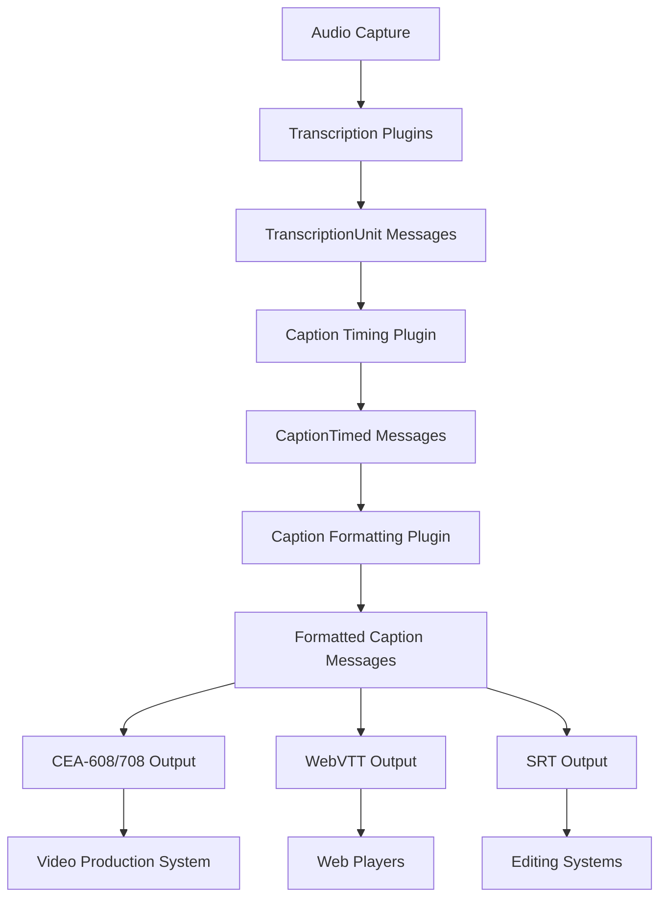

# 04. Caption Processing System

## Table of Contents

- [Caption Processing System](#caption-processing-system)
  - [Table of Contents](#table-of-contents)
  - [1. Captioning System Overview](#1-captioning-system-overview)
    - [1.1 Design Goals](#11-design-goals)
    - [1.2 System Architecture](#12-system-architecture)
    - [1.3 Caption Processing Pipeline](#13-caption-processing-pipeline)
  - [2. Caption Data Model](#2-caption-data-model)
    - [2.1 TranscriptionUnit Structure](#21-transcriptionunit-structure)
    - [2.2 CaptionTimed Structure](#22-captiontimed-structure)
    - [2.3 Caption Format Standards](#23-caption-format-standards)
  - [3. Caption Generation Pipeline](#3-caption-generation-pipeline)
    - [3.1 Transcription to Caption Flow](#31-transcription-to-caption-flow)
    - [3.2 Word Grouping Strategies](#32-word-grouping-strategies)
    - [3.3 Timing Calculation](#33-timing-calculation)
  - [4. Caption Formatting System](#4-caption-formatting-system)
    - [4.1 Line Breaking and Layout](#41-line-breaking-and-layout)
    - [4.2 Character Count Optimization](#42-character-count-optimization)
    - [4.3 Style and Appearance](#43-style-and-appearance)
  - [5. Caption Synchronization](#5-caption-synchronization)
    - [5.1 Real-time Synchronization](#51-real-time-synchronization)
    - [5.2 Clock Management](#52-clock-management)
    - [5.3 Handling Network Jitter](#53-handling-network-jitter)
  - [6. Caption Output Formats](#6-caption-output-formats)
    - [6.1 CEA-608/708 Support](#61-cea-608708-support)
    - [6.2 WebVTT Generation](#62-webvtt-generation)
    - [6.3 SRT and Other Formats](#63-srt-and-other-formats)
  - [7. Caption Plugins](#7-caption-plugins)
    - [7.1 Caption Timing Plugin](#71-caption-timing-plugin)
    - [7.2 Caption Formatting Plugin](#72-caption-formatting-plugin)
    - [7.3 Caption Output Plugin](#73-caption-output-plugin)
    - [7.4 Caption Correction Plugin](#74-caption-correction-plugin)
  - [8. Performance Considerations](#8-performance-considerations)
    - [8.1 Latency Budget](#81-latency-budget)
    - [8.2 Memory Optimization](#82-memory-optimization)
    - [8.3 Throughput Requirements](#83-throughput-requirements)
  - [9. Testing and Validation](#9-testing-and-validation)
    - [9.1 Caption Quality Testing](#91-caption-quality-testing)
    - [9.2 Synchronization Testing](#92-synchronization-testing)
    - [9.3 Format Compliance](#93-format-compliance)

## 1. Captioning System Overview

### 1.1 Design Goals

The Echo Core captioning system is designed to meet the following key requirements:

1. **Ultra-Low Latency**: Deliver captions within 750ms of spoken audio
2. **High Accuracy**: Ensure captions correctly represent spoken content
3. **Format Compliance**: Support industry standard caption formats (CEA-608/708, WebVTT, SRT)
4. **Accessibility**: Meet or exceed accessibility requirements for captions
5. **Seamless Integration**: Integrate with video production systems via standard protocols
6. **Adaptability**: Support multiple languages and transcription providers
7. **Correction Handling**: Gracefully handle and apply corrections to displayed captions

These goals drive the architecture and implementation decisions throughout the captioning pipeline.

### 1.2 System Architecture

The captioning system follows a modular architecture consisting of specialized plugins that transform transcription data into broadcast-ready captions:



This pipeline transforms raw audio into properly timed, formatted captions that can be integrated into various video delivery systems.

### 1.3 Caption Processing Pipeline

The caption processing pipeline consists of several stages:

1. **Transcription**: Audio is converted to word-level transcription units with timing information
2. **Timing Analysis**: Words are grouped into caption segments with precise timing
3. **Formatting**: Caption segments are formatted for readability and accessibility
4. **Format Conversion**: Formatted captions are converted to industry-standard formats
5. **Delivery**: Captions are sent to video production systems in real-time

Each stage is implemented as a plugin or set of plugins that communicate via the message bus, allowing for flexible deployment and configuration.

## 2. Caption Data Model

### 2.1 TranscriptionUnit Structure

The foundation of the captioning system is the `TranscriptionUnit` structure, which represents word-level transcription data:

```rust
pub struct TranscriptionUnit {
    // Unique identifier with embedded timestamp
    pub id: Uuid,
    
    // Text content (word or partial sentence)
    pub text: String,
    
    // Timing information in milliseconds
    pub start_time: u64,
    pub duration: u64,
    
    // Metadata flags packed into a bitfield
    pub flags: u16,
    
    // Sequence number for ordering
    pub sequence: u32,
    
    // Optional confidence score
    pub confidence: Option<f32>,
    
    // Source provider information
    pub provider: String,
}
```

The `flags` field uses bit flags to efficiently encode message attributes:

```rust
// Flag bit positions
pub const FLAG_FINAL: u16 = 0x0001;      // Final transcription (not tentative)
pub const FLAG_CORRECTION: u16 = 0x0002; // Correction to previous transcription
pub const FLAG_END_OF_SENTENCE: u16 = 0x0004; // End of sentence marker
pub const FLAG_END_OF_PARAGRAPH: u16 = 0x0008; // End of paragraph marker
pub const FLAG_SPEAKER_CHANGE: u16 = 0x0010; // Speaker has changed
pub const FLAG_LOW_CONFIDENCE: u16 = 0x0020; // Low confidence in transcription
pub const FLAG_SILENCE: u16 = 0x0040;    // Represents a silence period
pub const FLAG_MUSIC: u16 = 0x0080;      // Represents music/non-speech audio
```

### 2.2 CaptionTimed Structure

The `CaptionTimed` structure represents a caption segment ready for display:

```rust
pub struct CaptionTimed {
    // Unique identifier
    pub id: Uuid,
    
    // Full text content for this caption segment
    pub text: String,
    
    // Timing information in milliseconds
    pub start_time: u64,
    pub end_time: u64,
    
    // Display position (line number, vertical position)
    pub position: CaptionPosition,
    
    // Formatting information
    pub style: CaptionStyle,
    
    // Speaker identification
    pub speaker: Option<String>,
    
    // Source information
    pub source_id: Uuid,
    pub provider: String,
}

pub struct CaptionPosition {
    pub vertical_position: u8,    // 0-15, where 0 is top
    pub horizontal_alignment: HorizontalAlignment,
}

pub enum HorizontalAlignment {
    Left,
    Center,
    Right,
}

pub struct CaptionStyle {
    pub font_style: FontStyle,
    pub foreground_color: Color,
    pub background_color: Color,
    pub edge_type: EdgeType,
    pub edge_color: Color,
}
```

### 2.3 Caption Format Standards

The captioning system supports three primary caption format standards:

1. **CEA-608/708**: Broadcast standard for closed captioning
   - Required for television broadcast in many countries
   - Supports positioning, colors, and special characters
   - Limited character count per line (32 for CEA-608, 42 for CEA-708)

2. **WebVTT**: Web Video Text Tracks format
   - Standard for web-based video players
   - Supports styling, positioning, and metadata
   - Compatible with HTML5 video elements

3. **SRT**: SubRip Text format
   - Simple text-based format for subtitle files
   - Widely supported by editing and playback systems
   - Limited styling capabilities

Each format has specific constraints that influence the formatting process, particularly around line length, positioning, and timing precision.

## 3. Caption Generation Pipeline

### 3.1 Transcription to Caption Flow

The transformation from transcription to captions follows this process:

1. **Word Collection**: Individual `TranscriptionUnit` messages are collected into groups
2. **Sentence Formation**: Words are combined into complete sentences where possible
3. **Caption Segmentation**: Sentences are broken into caption segments based on:
   - Maximum character count per line
   - Natural linguistic breaks
   - Maximum display duration
4. **Timing Calculation**: Precise start and end times are calculated for each segment
5. **Caption Generation**: `CaptionTimed` messages are created and published

This process is implemented across several plugins, with the Caption Timing Plugin handling the core transformation logic.

### 3.2 Word Grouping Strategies

The system employs several strategies for grouping words into caption segments:

1. **Time-Based Grouping**: Combining words within specific time windows (e.g., 1-3 seconds)
2. **Sentence-Based Grouping**: Using linguistic markers to identify complete sentences
3. **Character Count Grouping**: Ensuring segments don't exceed format-specific character limits
4. **Speaker-Based Grouping**: Creating new segments when speakers change

These strategies are combined and weighted based on configuration settings:

```rust
pub struct CaptionGroupingConfig {
    // Maximum characters per line (format dependent)
    pub max_chars_per_line: u8,
    
    // Maximum number of lines per caption segment
    pub max_lines: u8,
    
    // Preferred display duration range (ms)
    pub min_duration: u64,
    pub max_duration: u64,
    
    // Prioritize linguistic breaks over timing
    pub prioritize_linguistic_breaks: bool,
    
    // Create new segment on speaker change
    pub break_on_speaker_change: bool,
}
```

### 3.3 Timing Calculation

Precise timing is critical for caption synchronization. The system calculates timing using:

1. **Word-Level Timing**: Using the start time and duration of each word
2. **Reading Speed Adjustment**: Ensuring captions are displayed long enough to read (typically 160-180 words per minute)
3. **Gap Management**: Handling silence gaps between caption segments
4. **Correction Handling**: Adjusting timing when transcription corrections arrive

The timing calculation algorithm ensures that captions appear at the right time and remain visible long enough to read:

```rust
fn calculate_caption_timing(words: &[TranscriptionUnit], config: &CaptionTimingConfig) -> (u64, u64) {
    // Start time is the start of the first word
    let start_time = words.first().map(|w| w.start_time).unwrap_or(0);
    
    // Calculate raw end time from last word
    let last_word = words.last().unwrap();
    let raw_end_time = last_word.start_time + last_word.duration;
    
    // Calculate minimum duration based on reading speed
    let char_count = words.iter().map(|w| w.text.len()).sum::<usize>();
    let min_duration = (char_count as f64 / config.reading_speed as f64 * 60000.0) as u64;
    
    // Ensure minimum display duration
    let end_time = start_time + std::cmp::max(min_duration, raw_end_time - start_time);
    
    (start_time, end_time)
}
```

## 4. Caption Formatting System

### 4.1 Line Breaking and Layout

The Caption Formatting Plugin implements intelligent line breaking that considers:

1. **Natural Language Breaks**: Preferring breaks at punctuation and clause boundaries
2. **Line Balance**: Creating visually balanced lines of similar length
3. **Format Constraints**: Respecting maximum line length limitations
4. **Linguistic Units**: Keeping related words together (e.g., articles with nouns)

The line breaking algorithm uses a cost function to evaluate different break options:

```rust
fn calculate_break_cost(text: &str, break_points: &[usize], max_line_length: usize) -> f64 {
    let mut cost = 0.0;
    let mut current_pos = 0;
    
    for &break_point in break_points {
        let line_length = break_point - current_pos;
        
        // Penalize lines that approach max length
        if line_length > max_line_length * 0.9 {
            cost += 10.0;
        }
        
        // Penalize breaking within linguistic units
        if !is_natural_break(text, break_point) {
            cost += 5.0;
        }
        
        // Penalize unbalanced lines
        cost += (line_length as f64 - (max_line_length as f64 * 0.7)).abs();
        
        current_pos = break_point + 1; // Skip the space or punctuation
    }
    
    cost
}
```

### 4.2 Character Count Optimization

Different caption formats have different character count limitations:

- CEA-608: 32 characters per line, 4 lines maximum
- CEA-708: 42 characters per line, flexible line count
- WebVTT/SRT: No strict limit, but typically 37-42 characters for readability

The system optimizes caption segmentation based on these constraints:

```rust
fn optimize_caption_segments(text: &str, config: &CaptionFormatConfig) -> Vec<String> {
    // Determine effective character limit based on format
    let char_limit = match config.format {
        CaptionFormat::CEA608 => 32,
        CaptionFormat::CEA708 => 42,
        CaptionFormat::WebVTT => 37,
        CaptionFormat::SRT => 37,
    };
    
    // Find optimal break points
    let break_points = find_optimal_breaks(text, char_limit, config.max_lines);
    
    // Split text at break points
    let mut segments = Vec::new();
    let mut start = 0;
    
    for &break_point in &break_points {
        segments.push(text[start..break_point].trim().to_string());
        start = break_point;
    }
    
    // Add final segment
    if start < text.len() {
        segments.push(text[start..].trim().to_string());
    }
    
    segments
}
```

### 4.3 Style and Appearance

Caption styling depends on the output format's capabilities:

1. **CEA-708**: Supports colors, fonts, edges, and positioning
2. **WebVTT**: Supports CSS-like styling with customizable colors and positions
3. **SRT**: Limited styling, primarily through simple HTML-like tags

The `CaptionStyle` structure is converted to format-specific styling instructions:

```rust
fn apply_cea708_styling(caption: &CaptionTimed) -> CEA708Caption {
    let mut cea_caption = CEA708Caption::new(caption.text.clone());
    
    // Apply foreground color
    cea_caption.set_foreground_color(convert_color(caption.style.foreground_color));
    
    // Apply background color
    cea_caption.set_background_color(convert_color(caption.style.background_color));
    
    // Apply edge type and color
    cea_caption.set_edge_type(convert_edge_type(caption.style.edge_type));
    cea_caption.set_edge_color(convert_color(caption.style.edge_color));
    
    // Apply position
    cea_caption.set_vertical_position(caption.position.vertical_position);
    cea_caption.set_horizontal_alignment(convert_alignment(caption.position.horizontal_alignment));
    
    cea_caption
}
```

## 5. Caption Synchronization

### 5.1 Real-time Synchronization

Achieving proper synchronization between captions and video requires:

1. **Common Timing Reference**: Using a shared clock reference across the system
2. **End-to-End Latency Management**: Accounting for all processing steps from audio to display
3. **Predictive Display**: Calculating optimal times to display captions based on word timing
4. **Buffer Management**: Ensuring smooth caption display despite variable processing times

The system uses a combination of absolute timestamps and relative offsets:

```rust
pub struct SynchronizationConfig {
    // Target end-to-end latency budget (ms)
    pub target_latency: u64,
    
    // Clock synchronization method
    pub clock_sync_method: ClockSyncMethod,
    
    // Buffer settings for smoothing
    pub buffer_size: u64,
    pub max_buffer_delay: u64,
}

pub enum ClockSyncMethod {
    // Use system wall clock for absolute timing
    SystemClock,
    
    // Use media clock for relative timing
    MediaClock,
    
    // Use PTP for precision timing
    PTP,
    
    // Use NTP for distributed timing
    NTP,
}
```

### 5.2 Clock Management

The system supports multiple clock synchronization methods:

1. **System Clock**: Using the system wall clock for timing
2. **Media Clock**: Using the media pipeline's clock for relative timing
3. **PTP (Precision Time Protocol)**: For high-precision timing in broadcast environments
4. **NTP**: For distributed timing across networks

The implementation uses a clock abstraction that can be swapped based on configuration:

```rust
pub trait ClockSource: Send + Sync {
    // Get current timestamp in milliseconds
    fn now(&self) -> u64;
    
    // Convert from another time reference
    fn convert_from(&self, other_timestamp: u64, source: ClockSource) -> u64;
    
    // Estimate clock skew with another source
    fn estimate_skew(&self, other: &dyn ClockSource) -> i64;
}
```

### 5.3 Handling Network Jitter

In distributed environments, network jitter can affect caption timing. The system employs several strategies to mitigate this:

1. **Adaptive Buffering**: Dynamically adjusting buffer size based on observed network conditions
2. **Timestamp Correction**: Correcting for clock drift between system components
3. **Predictive Timing**: Anticipating caption timing based on historical patterns
4. **Smooth Catchup**: Gracefully adjusting timing when captions fall behind or get ahead

```rust
fn calculate_display_time(
    caption: &CaptionTimed, 
    network_stats: &NetworkStats,
    config: &SynchronizationConfig
) -> u64 {
    // Base display time from caption
    let base_time = caption.start_time;
    
    // Adjust for observed network jitter
    let jitter_buffer = std::cmp::min(
        network_stats.average_jitter * 2,
        config.max_buffer_delay
    );
    
    // Apply buffer
    base_time + jitter_buffer
}
```

## 6. Caption Output Formats

### 6.1 CEA-608/708 Support

CEA-608/708 are the standard formats for broadcast closed captioning:

1. **CEA-608**: Legacy format with limited capabilities but wide support
2. **CEA-708**: Modern format with enhanced styling and positioning

The system generates compliant CEA-608/708 data that can be inserted into video streams:

```rust
fn generate_cea708_packet(caption: &CaptionTimed) -> Vec<u8> {
    let mut packet = Vec::new();
    
    // Add service number 1
    packet.push(0x01);
    
    // Add window attributes
    let window_attr = calculate_window_attributes(caption);
    packet.push(window_attr);
    
    // Add pen attributes
    let pen_attr = calculate_pen_attributes(caption.style);
    packet.extend_from_slice(&pen_attr);
    
    // Add text with appropriate control codes
    let encoded_text = encode_cea708_text(&caption.text);
    packet.extend_from_slice(&encoded_text);
    
    packet
}
```

### 6.2 WebVTT Generation

WebVTT (Web Video Text Tracks) is the standard format for web-based video players:

```rust
fn generate_webvtt_cue(caption: &CaptionTimed) -> String {
    // Format timestamps as HH:MM:SS.mmm
    let start = format_webvtt_timestamp(caption.start_time);
    let end = format_webvtt_timestamp(caption.end_time);
    
    // Build cue with timing
    let mut cue = format!("{} --> {}", start, end);
    
    // Add positioning if specified
    if caption.position.vertical_position != 7 { // Default middle position
        let position = 100 - (caption.position.vertical_position as f32 / 15.0 * 100.0);
        cue.push_str(&format!(" line:{}%", position));
    }
    
    // Add alignment
    match caption.position.horizontal_alignment {
        HorizontalAlignment::Left => cue.push_str(" align:left"),
        HorizontalAlignment::Right => cue.push_str(" align:right"),
        HorizontalAlignment::Center => (), // Center is default
    }
    
    // Add styling if needed
    if needs_styling(&caption.style) {
        cue.push_str("\n<c.");
        cue.push_str(&generate_webvtt_classes(&caption.style));
        cue.push_str(">");
        cue.push_str(&caption.text);
        cue.push_str("</c>");
    } else {
        cue.push_str("\n");
        cue.push_str(&caption.text);
    }
    
    cue
}
```

### 6.3 SRT and Other Formats

The system supports additional formats including:

1. **SRT**: Simple subtitle format widely used in editing systems
2. **TTML**: Timed Text Markup Language, used in some broadcast systems
3. **DFXP**: Distribution Format Exchange Profile, based on TTML

```rust
fn generate_srt_subtitle(caption: &CaptionTimed, index: usize) -> String {
    // Format timestamps as HH:MM:SS,mmm (SRT uses comma instead of period)
    let start = format_srt_timestamp(caption.start_time);
    let end = format_srt_timestamp(caption.end_time);
    
    // Build subtitle with sequence number and timing
    let mut subtitle = format!("{}\n{} --> {}\n", index, start, end);
    
    // Add text with simple styling if supported
    if uses_basic_styling(&caption.style) {
        subtitle.push_str(&apply_srt_styling(&caption.text, &caption.style));
    } else {
        subtitle.push_str(&caption.text);
    }
    
    subtitle
}
```

## 7. Caption Plugins

### 7.1 Caption Timing Plugin

The Caption Timing Plugin transforms word-level transcriptions into timed caption segments:

```rust
pub struct CaptionTimingPlugin {
    // Plugin core fields
    name: String,
    context: Arc<PluginContext>,
    
    // Configuration
    config: Arc<RwLock<CaptionTimingConfig>>,
    
    // State
    state: Arc<RwLock<CaptionTimingState>>,
}

struct CaptionTimingState {
    // Current word buffer
    word_buffer: Vec<TranscriptionUnit>,
    
    // Last processed timestamp
    last_timestamp: u64,
    
    // Processing statistics
    segments_created: u64,
    words_processed: u64,
}
```

The plugin subscribes to `transcript.word` messages and publishes `caption.timed` messages:

```rust
impl Plugin for CaptionTimingPlugin {
    // ...implementation...
    
    async fn process_message(&self, topic: &str, message: &BaseMessage) -> Result<ProcessingStatus, PluginError> {
        match topic {
            "transcript.word" => {
                // Parse TranscriptionUnit from message
                let word = parse_transcription_unit(message)?;
                
                // Process the word
                self.process_word(word).await
            },
            "system.command" => {
                // Handle system commands like flush buffer
                self.process_command(message).await
            },
            _ => Ok(ProcessingStatus::Acknowledged),
        }
    }
}
```

### 7.2 Caption Formatting Plugin

The Caption Formatting Plugin applies formatting rules to timed caption segments:

```rust
pub struct CaptionFormattingPlugin {
    // Plugin core fields
    name: String,
    context: Arc<PluginContext>,
    
    // Configuration
    config: Arc<RwLock<CaptionFormattingConfig>>,
    
    // Language-specific formatting rules
    language_rules: HashMap<String, LanguageFormattingRules>,
}

struct CaptionFormattingConfig {
    // Default output format
    default_format: CaptionFormat,
    
    // Line breaking settings
    max_chars_per_line: u8,
    max_lines: u8,
    
    // Style settings
    default_style: CaptionStyle,
}
```

The plugin subscribes to `caption.timed` messages and publishes `caption.formatted` messages:

```rust
impl CaptionFormattingPlugin {
    async fn format_caption(&self, caption: &CaptionTimed) -> Result<ProcessingStatus, PluginError> {
        // Detect language if not specified
        let language = caption.language.as_deref().unwrap_or("en-US");
        
        // Get language-specific rules
        let rules = self.get_language_rules(language);
        
        // Apply line breaking
        let formatted_lines = self.apply_line_breaking(&caption.text, rules);
        
        // Apply styling
        let styled_caption = self.apply_styling(caption, &formatted_lines);
        
        // Publish formatted caption
        self.publish_formatted_caption(styled_caption).await
    }
}
```

### 7.3 Caption Output Plugin

The Caption Output Plugin converts formatted captions to industry-standard formats:

```rust
pub struct CaptionOutputPlugin {
    // Plugin core fields
    name: String,
    context: Arc<PluginContext>,
    
    // Configuration
    config: Arc<RwLock<CaptionOutputConfig>>,
    
    // Output adapters
    cea_adapter: Option<Arc<CEA708Adapter>>,
    webvtt_adapter: Option<Arc<WebVTTAdapter>>,
    srt_adapter: Option<Arc<SRTAdapter>>,
}

struct CaptionOutputConfig {
    // Enabled output formats
    enable_cea: bool,
    enable_webvtt: bool,
    enable_srt: bool,
    
    // Output settings
    cea_output_address: String,
    webvtt_output_path: String,
    srt_output_path: String,
}
```

The plugin subscribes to `caption.formatted` messages and outputs to various destinations:

```rust
impl CaptionOutputPlugin {
    async fn output_caption(&self, caption: &FormattedCaption) -> Result<ProcessingStatus, PluginError> {
        // Track metrics
        let start = std::time::Instant::now();
        
        // Output to all enabled formats
        if let Some(cea_adapter) = &self.cea_adapter {
            cea_adapter.send_caption(caption).await?;
        }
        
        if let Some(webvtt_adapter) = &self.webvtt_adapter {
            webvtt_adapter.write_caption(caption).await?;
        }
        
        if let Some(srt_adapter) = &self.srt_adapter {
            srt_adapter.write_caption(caption).await?;
        }
        
        // Record latency
        let duration = start.elapsed();
        self.context.record_histogram(
            "caption_output_time", 
            duration.as_secs_f64() * 1000.0,
            Some(HashMap::new())
        );
        
        Ok(ProcessingStatus::Acknowledged)
    }
}
```

### 7.4 Caption Correction Plugin

The Caption Correction Plugin handles updates and corrections to captions:

```rust
pub struct CaptionCorrectionPlugin {
    // Plugin core fields
    name: String,
    context: Arc<PluginContext>,
    
    // Configuration
    config: Arc<RwLock<CaptionCorrectionConfig>>,
    
    // State
    state: Arc<RwLock<CaptionCorrectionState>>,
}

struct CaptionCorrectionState {
    // Recent captions for correction
    recent_captions: HashMap<Uuid, CaptionTimed>,
    
    // Correction statistics
    corrections_applied: u64,
    corrections_rejected: u64,
}
```

The plugin subscribes to both caption and correction messages:

```rust
impl CaptionCorrectionPlugin {
    async fn process_correction(&self, correction: &TranscriptionCorrection) -> Result<ProcessingStatus, PluginError> {
        let mut state = self.state.write().await;
        
        // Check if the target caption is still in our recent history
        if let Some(original) = state.recent_captions.get(&correction.target_id) {
            // Create corrected caption
            let corrected = self.apply_correction(original, correction);
            
            // Determine if caption is still on screen
            if is_caption_current(&corrected) {
                // Publish correction with same timing
                self.publish_correction(corrected).await?;
                state.corrections_applied += 1;
            } else {
                // Just update database record, don't display
                self.update_caption_record(corrected).await?;
                state.corrections_rejected += 1;
            }
            
            Ok(ProcessingStatus::Acknowledged)
        } else {
            // Target caption not found in recent history
            Ok(ProcessingStatus::Failed("Target caption not found in recent history".to_string()))
        }
    }
}
```

## 8. Performance Considerations

### 8.1 Latency Budget

The captioning system operates with a strict 750ms end-to-end latency budget:

| Stage | Budget | Description |
|-------|--------|-------------|
| Audio Capture | 50ms | Time from sound to digital audio |
| Transcription | 300ms | Transcription service processing |
| Caption Timing | 100ms | Word grouping and timing calculation |
| Caption Formatting | 50ms | Line breaking and styling |
| Output Conversion | 50ms | Format-specific conversion |
| Network Transit | 100ms | Delivery to video production system |
| Buffer | 100ms | Reserved for jitter and network variance |

Optimizations focus on the critical path components:

```rust
// Critical path optimization with zero-copy where possible
fn process_transcription_unit(&self, unit: TranscriptionUnit) -> Result<(), PluginError> {
    // Avoid cloning by using references where possible
    let result = if self.should_create_caption(&unit) {
        // Create new caption only when needed
        self.create_caption_from_buffer(&unit)
    } else {
        // Just update buffer, no message created
        self.update_word_buffer(&unit);
        return Ok(());
    };
    
    // Only publish when necessary
    if let Some(caption) = result {
        self.publish_caption(caption).await?;
    }
    
    Ok(())
}
```

### 8.2 Memory Optimization

Caption processing requires efficient memory management:

1. **Buffer Pooling**: Reusing buffers for caption text to reduce allocations
2. **Zero-Copy Processing**: Using references instead of cloning data where possible
3. **Right-Sized Containers**: Using appropriate collection types and pre-allocation
4. **Compact Representations**: Using bit flags and compact data structures

```rust
// Memory-efficient buffer management
impl CaptionTimingPlugin {
    fn get_or_create_buffer(&self) -> Vec<char> {
        let mut pool = self.buffer_pool.write().await;
        
        match pool.pop() {
            Some(buffer) => buffer,
            None => Vec::with_capacity(256) // Pre-allocate sufficient capacity
        }
    }
    
    fn return_buffer(&self, mut buffer: Vec<char>) {
        buffer.clear(); // Clear but preserve capacity
        
        let mut pool = self.buffer_pool.write().await;
        if pool.len() < MAX_POOLED_BUFFERS {
            pool.push(buffer);
        }
    }
}
```

### 8.3 Throughput Requirements

The system must handle high-volume caption processing:

1. **Multiple Streams**: Supporting concurrent captioning of multiple video streams
2. **High Caption Rate**: Processing up to 5-10 caption segments per second per stream
3. **Format Conversion**: Converting captions to multiple output formats simultaneously

Performance is optimized through:

1. **Parallelization**: Using worker pools to process multiple streams concurrently
2. **Batch Processing**: Grouping operations for more efficient processing
3. **Adaptive Scaling**: Adjusting resources based on load

```rust
// Adaptive scaling based on load
impl CaptionOutputPlugin {
    fn adjust_worker_count(&self) {
        let current_load = self.calculate_load();
        let current_workers = self.worker_pool.worker_count();
        
        if current_load > 0.8 && current_workers < self.config.max_workers {
            // Scale up
            self.worker_pool.add_workers(2);
        } else if current_load < 0.3 && current_workers > self.config.min_workers {
            // Scale down
            self.worker_pool.remove_workers(1);
        }
    }
}
```

## 9. Testing and Validation

### 9.1 Caption Quality Testing

Testing caption quality involves:

1. **Linguistic Tests**: Verifying proper sentence structure and line breaks
2. **Readability Tests**: Ensuring captions can be read at expected speeds
3. **Accuracy Tests**: Comparing caption text with original audio content
4. **Edge Case Testing**: Handling special characters, formatting, and languages

```rust
#[test]
fn test_line_breaking_quality() {
    let formatter = CaptionFormattingPlugin::new(test_config());
    
    // Test various input texts
    let test_cases = vec![
        "This is a short sentence.",
        "This is a longer sentence that should be broken across multiple lines for readability.",
        "This-has-hyphens-and.various.punctuation,marks;to:test!breaking?rules.",
    ];
    
    for test in test_cases {
        let result = formatter.apply_line_breaking(test);
        
        // Verify no line exceeds maximum length
        for line in &result {
            assert!(line.len() <= MAX_LINE_LENGTH);
        }
        
        // Verify linguistic break points were respected
        verify_break_points(test, &result);
    }
}
```

### 9.2 Synchronization Testing

Testing caption synchronization involves:

1. **Timing Accuracy**: Verifying captions appear at the correct time
2. **End-to-End Delay**: Measuring the total delay from audio to caption display
3. **Jitter Handling**: Testing behavior under variable network conditions
4. **Clock Drift**: Verifying long-term synchronization remains correct

```rust
#[tokio::test]
async fn test_end_to_end_timing() {
    // Set up test environment
    let (audio_sender, caption_receiver) = set_up_test_pipeline().await;
    
    // Send test audio with timestamp
    let start_time = std::time::Instant::now();
    let test_audio = create_test_audio("Hello world");
    audio_sender.send(test_audio).await.unwrap();
    
    // Receive resulting caption
    let caption = caption_receiver.recv().await.unwrap();
    let end_time = std::time::Instant::now();
    
    // Calculate end-to-end delay
    let delay = end_time.duration_since(start_time);
    
    // Verify delay is within acceptable range
    assert!(delay.as_millis() < 750, "End-to-end delay too high: {:?}", delay);
    
    // Verify caption content matches input
    assert!(caption.text.contains("Hello world"));
}
```

### 9.3 Format Compliance

Testing format compliance involves:

1. **Standard Conformance**: Verifying output meets format specifications
2. **Player Compatibility**: Testing with common video players and systems
3. **Validation Tools**: Using format-specific validators to verify compliance
4. **Broadcast Readiness**: Testing with broadcast equipment for CEA-608/708

```rust
#[test]
fn test_cea708_compliance() {
    let caption = create_test_caption();
    let output_plugin = CaptionOutputPlugin::new(cea708_config());
    
    // Generate CEA-708 packet
    let packet = output_plugin.generate_cea708_packet(&caption);
    
    // Validate packet structure
    assert_eq!(packet[0], 0x01); // Service number 1
    
    // Verify packet can be decoded correctly
    let decoded = decode_cea708_packet(&packet);
    assert_eq!(decoded.text, caption.text);
    
    // Check for invalid control codes
    verify_no_invalid_control_codes(&packet);
    
    // Verify caption window attributes
    verify_window_attributes(&packet, &caption);
}
```
