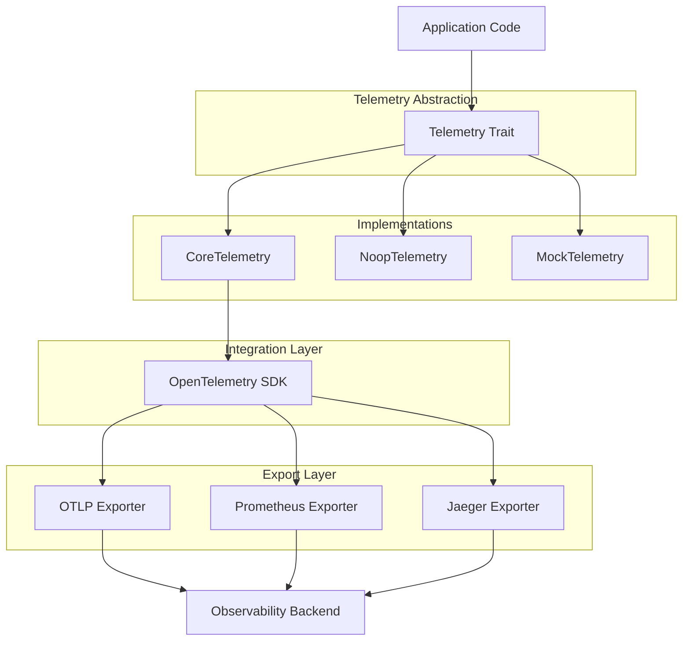

# 05. Analytics and Telemetry

## Table of Contents

- [Analytics and Telemetry](#analytics-and-telemetry)
  - [Table of Contents](#table-of-contents)
  - [1. Telemetry System Overview](#1-telemetry-system-overview)
    - [1.1 Design Goals](#11-design-goals)
    - [1.2 System Architecture](#12-system-architecture)
    - [1.3 OpenTelemetry Integration](#13-opentelemetry-integration)
  - [2. Core Telemetry Components](#2-core-telemetry-components)
    - [2.1 Telemetry Trait](#21-telemetry-trait)
    - [2.2 Telemetry Context](#22-telemetry-context)
    - [2.3 BoxedSpan and SpanGuard](#23-boxedspan-and-spanguard)
    - [2.4 Attributes Module](#24-attributes-module)
  - [3. Data Collection Types](#3-data-collection-types)
    - [3.1 Metrics Collection](#31-metrics-collection)
    - [3.2 Trace Generation](#32-trace-generation)
    - [3.3 Log Integration](#33-log-integration)
    - [3.4 Context Propagation](#34-context-propagation)
  - [4. Telemetry Implementation](#4-telemetry-implementation)
    - [4.1 CoreTelemetry](#41-coretelemetry)
    - [4.2 NoopTelemetry](#42-nooptelemetry)
    - [4.3 MockTelemetry](#43-mocktelemetry)
    - [4.4 Custom Implementations](#44-custom-implementations)
  - [5. Plugin Telemetry Integration](#5-plugin-telemetry-integration)
    - [5.1 Plugin Lifecycle Events](#51-plugin-lifecycle-events)
    - [5.2 Message Processing Instrumentation](#52-message-processing-instrumentation)
    - [5.3 Resource Usage Tracking](#53-resource-usage-tracking)
    - [5.4 Error Reporting](#54-error-reporting)
  - [6. Message Flow Tracing](#6-message-flow-tracing)
    - [6.1 Trace Context in Messages](#61-trace-context-in-messages)
    - [6.2 Cross-Component Tracing](#62-cross-component-tracing)
    - [6.3 End-to-End Flow Visualization](#63-end-to-end-flow-visualization)
    - [6.4 Latency Analysis](#64-latency-analysis)
  - [7. Analytics System](#7-analytics-system)
    - [7.1 Analytics Plugin](#71-analytics-plugin)
    - [7.2 Real-time Metrics Dashboard](#72-real-time-metrics-dashboard)
    - [7.3 System Health Monitoring](#73-system-health-monitoring)
    - [7.4 Performance Analytics](#74-performance-analytics)
  - [8. Testing and Validation](#8-testing-and-validation)
    - [8.1 Telemetry Testing](#81-telemetry-testing)
    - [8.2 Performance Impact Assessment](#82-performance-impact-assessment)
    - [8.3 Coverage Validation](#83-coverage-validation)
  - [9. Best Practices](#9-best-practices)
    - [9.1 Naming Conventions](#91-naming-conventions)
    - [9.2 Granularity Guidelines](#92-granularity-guidelines)
    - [9.3 Attribute Standards](#93-attribute-standards)
    - [9.4 Performance Considerations](#94-performance-considerations)

## 1. Telemetry System Overview

### 1.1 Design Goals

The Echo Core telemetry system is designed with the following key objectives:

1. **Complete Observability**: Provide comprehensive visibility into the system's behavior, performance, and health
2. **Minimal Performance Impact**: Collect telemetry data with negligible impact on core processing
3. **Standardized Integration**: Seamlessly integrate with industry-standard observability tools
4. **Context Propagation**: Maintain context across asynchronous boundaries and between components
5. **Pluggable Architecture**: Support multiple telemetry backends through a consistent abstraction
6. **Structured Data**: Collect well-structured, typed data for effective analysis
7. **Distributed Tracing**: Enable end-to-end tracking of requests across components

These goals ensure that Echo Core can be effectively monitored, debugged, and optimized in both development and production environments.

### 1.2 System Architecture

The telemetry system follows a layered architecture that separates abstractions from implementations:



Key components of this architecture:

1. **Telemetry Trait**: The core abstraction that all implementations must support
2. **Telemetry Context**: Maintains the current telemetry state and provides access to trace context
3. **Implementation Layer**: Concrete implementations for different scenarios (Core, Noop, Mock)
4. **Integration Layer**: Connects to the OpenTelemetry SDK for standards-based telemetry
5. **Export Layer**: Sends telemetry data to various backends (OTLP, Prometheus, Jaeger, etc.)

This architecture ensures flexibility while maintaining a consistent API for telemetry operations.

### 1.3 OpenTelemetry Integration

Echo Core integrates with OpenTelemetry to leverage industry-standard observability practices:

1. **Standards Compliance**: Follows OpenTelemetry standards for metrics, traces, and logs
2. **Protocol Support**: Implements the OpenTelemetry Protocol (OTLP) for data export
3. **Context Propagation**: Uses W3C Trace Context standard for cross-component tracing
4. **Semantic Conventions**: Adopts OpenTelemetry semantic conventions for attribute naming

```rust
// Example OpenTelemetry integration
fn initialize_telemetry() -> impl Telemetry {
    // Configure OpenTelemetry
    global::set_text_map_propagator(TraceContextPropagator::new());
    
    // Configure OpenTelemetry exporters
    let exporter = opentelemetry_otlp::new_exporter()
        .tonic()
        .with_endpoint("https://otel-collector.example.com:4317");
    
    // Create OpenTelemetry TracerProvider
    let tracer_provider = opentelemetry_otlp::new_pipeline()
        .tracing()
        .with_exporter(exporter)
        .with_trace_config(trace::config().with_resource(Resource::new(vec![
            KeyValue::new("service.name", "echo-core"),
            KeyValue::new("service.version", env!("CARGO_PKG_VERSION")),
        ])))
        .install_batch(runtime::Tokio)
        .expect("Failed to initialize OpenTelemetry");
    
    // Create OpenTelemetry MeterProvider
    let meter_provider = opentelemetry_otlp::new_pipeline()
        .metrics()
        .with_exporter(exporter)
        .with_resource(Resource::new(vec![
            KeyValue::new("service.name", "echo-core"),
            KeyValue::new("service.version", env!("CARGO_PKG_VERSION")),
        ]))
        .install_batch(runtime::Tokio)
        .expect("Failed to initialize OpenTelemetry metrics");
    
    // Create CoreTelemetry with OpenTelemetry
    CoreTelemetry::new(tracer_provider, meter_provider)
}
```

## 2. Core Telemetry Components

### 2.1 Telemetry Trait

The `Telemetry` trait defines the core interface for all telemetry operations:

```rust
pub trait Telemetry: Send + Sync + 'static {
    // Tracing operations
    fn create_span(&self, name: &str, attributes: Option<HashMap<String, String>>) -> Option<BoxedSpan>;
    fn set_span_status(&self, span: &BoxedSpan, status: SpanStatus, description: Option<&str>);
    fn add_span_event(&self, span: &BoxedSpan, name: &str, attributes: Option<HashMap<String, String>>);
    
    // Metrics operations
    fn record_counter(&self, name: &str, value: u64, attributes: Option<HashMap<String, String>>);
    fn record_gauge(&self, name: &str, value: f64, attributes: Option<HashMap<String, String>>);
    fn record_histogram(&self, name: &str, value: f64, attributes: Option<HashMap<String, String>>);
    
    // Context operations
    fn current_span(&self) -> Option<BoxedSpan>;
    fn with_span<T, F: FnOnce() -> T>(&self, span: Option<BoxedSpan>, f: F) -> T;
    
    // Utilities
    fn create_trace_context(&self, span: &BoxedSpan) -> Option<TraceContext>;
    fn parse_trace_context(&self, context: &TraceContext) -> Option<BoxedSpan>;
}
```

This trait ensures that all telemetry implementations provide consistent functionality regardless of the underlying backend.

### 2.2 Telemetry Context

The `TelemetryContext` provides access to telemetry operations and maintains the current telemetry state:

```rust
pub struct TelemetryContext {
    // The telemetry implementation
    telemetry: Arc<dyn Telemetry>,
    
    // Current message context
    message_context: Mutex<Option<MessageContext>>,
}

struct MessageContext {
    topic: String,
    message_id: Uuid,
}

impl TelemetryContext {
    // Create a new TelemetryContext
    pub fn new(telemetry: Arc<dyn Telemetry>) -> Self {
        Self {
            telemetry,
            message_context: Mutex::new(None),
        }
    }
    
    // Set the current message context
    pub fn set_current_message_context(&self, topic: String, message_id: Uuid) {
        let mut context = self.message_context.lock().unwrap();
        *context = Some(MessageContext { topic, message_id });
    }
    
    // Clear the current message context
    pub fn clear_current_message_context(&self) {
        let mut context = self.message_context.lock().unwrap();
        *context = None;
    }
    
    // Create a span with the current message context
    pub fn create_span(&self, name: &str, attributes: Option<HashMap<String, String>>) -> Option<BoxedSpan> {
        let mut attrs = attributes.unwrap_or_else(HashMap::new);
        
        // Add message context to attributes if available
        if let Some(context) = self.message_context.lock().unwrap().as_ref() {
            attrs.insert("message.topic".to_string(), context.topic.clone());
            attrs.insert("message.id".to_string(), context.message_id.to_string());
        }
        
        self.telemetry.create_span(name, Some(attrs))
    }
    
    // Delegate other methods to the underlying telemetry implementation
    pub fn record_counter(&self, name: &str, value: u64, attributes: Option<HashMap<String, String>>) {
        self.telemetry.record_counter(name, value, attributes);
    }
    
    pub fn record_gauge(&self, name: &str, value: f64, attributes: Option<HashMap<String, String>>) {
        self.telemetry.record_gauge(name, value, attributes);
    }
    
    pub fn record_histogram(&self, name: &str, value: f64, attributes: Option<HashMap<String, String>>) {
        self.telemetry.record_histogram(name, value, attributes);
    }
}
```

The `TelemetryContext` enriches telemetry operations with additional context information, particularly for message processing operations.

### 2.3 BoxedSpan and SpanGuard

The `BoxedSpan` type represents a span in a tracing system:

```rust
pub struct BoxedSpan {
    // Inner span implementation
    inner: Box<dyn Span>,
    
    // Span attributes
    attributes: HashMap<String, String>,
    
    // Span name
    name: String,
}

pub trait Span: Send + Sync + 'static {
    fn set_status(&self, status: SpanStatus, description: Option<&str>);
    fn add_event(&self, name: &str, attributes: Option<HashMap<String, String>>);
    fn end(&self);
}

impl BoxedSpan {
    // Create a new BoxedSpan
    pub fn new<S: Span + 'static>(span: S, name: String, attributes: HashMap<String, String>) -> Self {
        Self {
            inner: Box::new(span),
            attributes,
            name,
        }
    }
    
    // Set the status of the span
    pub fn set_status(&self, status: SpanStatus, description: Option<&str>) {
        self.inner.set_status(status, description);
    }
    
    // Add an event to the span
    pub fn add_event(&self, name: &str, attributes: Option<HashMap<String, String>>) {
        self.inner.add_event(name, attributes);
    }
    
    // End the span
    pub fn end(self) {
        self.inner.end();
    }
    
    // Enter the span and return a guard that ends the span when dropped
    pub fn enter(self) -> SpanGuard {
        SpanGuard { span: Some(self) }
    }
}

pub struct SpanGuard {
    span: Option<BoxedSpan>,
}

impl Drop for SpanGuard {
    fn drop(&mut self) {
        if let Some(span) = self.span.take() {
            span.end();
        }
    }
}
```

The `SpanGuard` pattern ensures that spans are properly ended even if an error occurs, using Rust's RAII pattern.

### 2.4 Attributes Module

The `attributes` module provides utilities for creating and manipulating telemetry attributes:

```rust
pub mod attributes {
    use std::collections::HashMap;
    
    // Create a HashMap from key-value pairs
    pub fn with_values<K: ToString, V: ToString>(pairs: &[(K, V)]) -> HashMap<String, String> {
        pairs
            .iter()
            .map(|(k, v)| (k.to_string(), v.to_string()))
            .collect()
    }
    
    // Create a HashMap with a single key-value pair
    pub fn with_value<K: ToString, V: ToString>(key: K, value: V) -> HashMap<String, String> {
        let mut map = HashMap::new();
        map.insert(key.to_string(), value.to_string());
        map
    }
    
    // Merge two attribute maps
    pub fn merge(mut base: HashMap<String, String>, additional: HashMap<String, String>) -> HashMap<String, String> {
        base.extend(additional);
        base
    }
    
    // Standard attribute keys
    pub mod keys {
        pub const SERVICE_NAME: &str = "service.name";
        pub const SERVICE_VERSION: &str = "service.version";
        pub const PLUGIN_NAME: &str = "plugin.name";
        pub const PLUGIN_VERSION: &str = "plugin.version";
        pub const PLUGIN_STATUS: &str = "plugin.status";
        pub const MESSAGE_TOPIC: &str = "message.topic";
        pub const MESSAGE_ID: &str = "message.id";
        pub const OPERATION: &str = "operation";
        pub const ERROR: &str = "error";
        pub const ERROR_TYPE: &str = "error.type";
    }
}
```

This module simplifies the creation of consistent attributes across the system and enforces naming conventions.

## 3. Data Collection Types

### 3.1 Metrics Collection

Echo Core collects three types of metrics:

1. **Counters**: Monotonically increasing values that track the number of occurrences
2. **Gauges**: Values that can increase or decrease over time, representing a current state
3. **Histograms**: Statistical distributions of values for analyzing patterns and outliers

```rust
// Counter metrics
telemetry.record_counter("messaging.published", 1, Some(attributes::with_values(&[
    ("message.topic", topic),
    ("message.source", message.source.as_str()),
])));

// Gauge metrics
telemetry.record_gauge("worker_pool.workers", workers_count as f64, Some(attributes::with_values(&[
    ("plugin.name", plugin_name),
    ("pool.type", pool_type),
])));

// Histogram metrics
telemetry.record_histogram("plugin.message.processing_time_ms", duration.as_secs_f64() * 1000.0, Some(attributes::with_values(&[
    ("plugin.name", plugin_name),
    ("message.topic", topic),
    ("status", status.to_string()),
])));
```

Each metric type is used for specific purposes:

- **Counters**: Message volumes, operation counts, error tallies
- **Gauges**: Active workers, queue depths, resource utilization
- **Histograms**: Processing times, message sizes, batch sizes

### 3.2 Trace Generation

Traces in Echo Core provide detailed information about the execution path of operations:

```rust
// Create a span for an operation
let span = telemetry.create_span("process_message", Some(attributes::with_values(&[
    ("plugin.name", plugin_name),
    ("message.id", message_id.to_string()),
    ("message.topic", topic),
])));

// Use the span guard pattern to ensure the span is properly ended
let _guard = span.as_ref().map(|s| s.enter());

// Add events to the span
if let Some(span) = &span {
    span.add_event("starting_processing", None);
}

// Set span status based on the outcome
if let Some(span) = &span {
    match result {
        Ok(_) => span.set_status(SpanStatus::Ok, None),
        Err(e) => span.set_status(SpanStatus::Error, Some(&e.to_string())),
    }
}

// Span ends automatically when _guard is dropped
```

The tracing system supports:

1. **Hierarchical Spans**: Parent-child relationships between spans
2. **Detailed Events**: Timestamped events within spans
3. **Status Tracking**: Success/error status with descriptions
4. **Rich Attributes**: Contextual information for analysis

### 3.3 Log Integration

The telemetry system integrates with the logging infrastructure to provide context-aware logs:

```rust
// Log with telemetry context
pub fn log_with_context(level: Level, message: &str, attributes: Option<HashMap<String, String>>, telemetry: &TelemetryContext) {
    // Get current span from telemetry
    let span = telemetry.current_span();
    
    // Create log record
    let mut all_attributes = HashMap::new();
    
    // Add span attributes if available
    if let Some(span) = &span {
        all_attributes.extend(span.attributes().clone());
    }
    
    // Add custom attributes
    if let Some(attrs) = attributes {
        all_attributes.extend(attrs);
    }
    
    // Add message context if available
    if let Some(ctx) = telemetry.message_context() {
        all_attributes.insert("message.topic".to_string(), ctx.topic.clone());
        all_attributes.insert("message.id".to_string(), ctx.message_id.to_string());
    }
    
    // Create structured log entry
    let log_entry = LogEntry {
        timestamp: Utc::now(),
        level,
        message: message.to_string(),
        attributes: all_attributes,
        trace_id: span.as_ref().and_then(|s| s.trace_id()),
        span_id: span.as_ref().and_then(|s| s.span_id()),
    };
    
    // Log through configured logger
    log::log(log_entry);
}
```

This integration ensures that logs are correlated with the relevant traces and contain consistent context information.

### 3.4 Context Propagation

Trace context is propagated through the system to maintain end-to-end traceability:

```rust
// Structure for storing trace context
#[derive(Clone, Debug, Serialize, Deserialize)]
pub struct TraceContext {
    pub trace_id: String,
    pub span_id: String,
    pub trace_flags: u8,
    pub trace_state: Option<String>,
}

// Example of context propagation in a message
impl MessageBuilder {
    // Add trace context from current span
    pub fn with_current_trace_context(mut self, telemetry: &dyn Telemetry) -> Self {
        if let Some(span) = telemetry.current_span() {
            if let Some(context) = telemetry.create_trace_context(&span) {
                self.trace_context = Some(context);
            }
        }
        self
    }
    
    // Add trace context from an existing context
    pub fn with_trace_context(mut self, context: Option<TraceContext>) -> Self {
        self.trace_context = context;
        self
    }
}

// Example of restoring context from a message
fn process_with_trace_context(message: &BaseMessage, telemetry: &dyn Telemetry) {
    // Extract trace context from message
    let parent_span = message.trace_context
        .as_ref()
        .and_then(|ctx| telemetry.parse_trace_context(ctx));
    
    // Create child span with the parent context
    let operation_span = telemetry.create_span_with_parent(
        "process_operation",
        Some(attributes),
        parent_span.as_ref(),
    );
    
    // Use the span
    let _guard = operation_span.as_ref().map(|s| s.enter());
    
    // Process with context
    // ...
}
```

Context propagation ensures that operations across different components and asynchronous boundaries can be correlated in the observability system.

## 4. Telemetry Implementation

### 4.1 CoreTelemetry

The `CoreTelemetry` implementation provides full telemetry functionality using OpenTelemetry:

```rust
pub struct CoreTelemetry {
    tracer: Tracer,
    meter: Meter,
}

impl CoreTelemetry {
    pub fn new(tracer_provider: TracerProvider, meter_provider: MeterProvider) -> Self {
        let tracer = tracer_provider.tracer("echo-core");
        let meter = meter_provider.meter("echo-core");
        
        Self { tracer, meter }
    }
}

impl Telemetry for CoreTelemetry {
    fn create_span(&self, name: &str, attributes: Option<HashMap<String, String>>) -> Option<BoxedSpan> {
        // Convert attributes to OpenTelemetry KeyValue pairs
        let attrs = attributes.map(|attrs| {
            attrs.iter()
                .map(|(k, v)| KeyValue::new(k.clone(), v.clone()))
                .collect::<Vec<_>>()
        }).unwrap_or_else(Vec::new);
        
        // Create OpenTelemetry span
        let span = self.tracer
            .span_builder(name)
            .with_attributes(attrs)
            .start(&self.tracer);
        
        // Create BoxedSpan
        Some(BoxedSpan::new(
            OtelSpan { span },
            name.to_string(),
            attributes.unwrap_or_default(),
        ))
    }
    
    fn record_counter(&self, name: &str, value: u64, attributes: Option<HashMap<String, String>>) {
        // Convert attributes to OpenTelemetry KeyValue pairs
        let attrs = attributes.map(|attrs| {
            attrs.iter()
                .map(|(k, v)| KeyValue::new(k.clone(), v.clone()))
                .collect::<Vec<_>>()
        }).unwrap_or_else(Vec::new);
        
        // Record counter metric
        self.meter
            .u64_counter(name)
            .add(&Context::current(), value, &attrs);
    }
    
    // Implement other methods...
}

struct OtelSpan {
    span: opentelemetry::trace::Span,
}

impl Span for OtelSpan {
    fn set_status(&self, status: SpanStatus, description: Option<&str>) {
        match status {
            SpanStatus::Ok => self.span.set_status(opentelemetry::trace::Status::Ok),
            SpanStatus::Error => {
                let status = match description {
                    Some(desc) => opentelemetry::trace::Status::error(desc.to_string()),
                    None => opentelemetry::trace::Status::error(""),
                };
                self.span.set_status(status);
            }
        }
    }
    
    fn add_event(&self, name: &str, attributes: Option<HashMap<String, String>>) {
        let attrs = attributes.map(|attrs| {
            attrs.iter()
                .map(|(k, v)| KeyValue::new(k.clone(), v.clone()))
                .collect::<Vec<_>>()
        }).unwrap_or_else(Vec::new);
        
        self.span.add_event(name, attrs);
    }
    
    fn end(&self) {
        self.span.end();
    }
}
```

The `CoreTelemetry` implementation provides full integration with OpenTelemetry for production use.

### 4.2 NoopTelemetry

The `NoopTelemetry` implementation provides a no-operation implementation for environments where telemetry is not needed:

```rust
pub struct NoopTelemetry;

impl Telemetry for NoopTelemetry {
    fn create_span(&self, _name: &str, _attributes: Option<HashMap<String, String>>) -> Option<BoxedSpan> {
        None
    }
    
    fn set_span_status(&self, _span: &BoxedSpan, _status: SpanStatus, _description: Option<&str>) {
        // No-op
    }
    
    fn add_span_event(&self, _span: &BoxedSpan, _name: &str, _attributes: Option<HashMap<String, String>>) {
        // No-op
    }
    
    fn record_counter(&self, _name: &str, _value: u64, _attributes: Option<HashMap<String, String>>) {
        // No-op
    }
    
    fn record_gauge(&self, _name: &str, _value: f64, _attributes: Option<HashMap<String, String>>) {
        // No-op
    }
    
    fn record_histogram(&self, _name: &str, _value: f64, _attributes: Option<HashMap<String, String>>) {
        // No-op
    }
    
    // Implement other methods with no-op behavior...
}
```

The `NoopTelemetry` implementation is useful for environments where telemetry would add unnecessary overhead, such as local development or testing.

### 4.3 MockTelemetry

The `MockTelemetry` implementation records telemetry operations for testing purposes:

```rust
pub struct MockTelemetry {
    counter_calls: Mutex<Vec<(String, u64, HashMap<String, String>)>>,
    gauge_calls: Mutex<Vec<(String, f64, HashMap<String, String>)>>,
    histogram_calls: Mutex<Vec<(String, f64, HashMap<String, String>)>>,
    spans: Mutex<Vec<MockSpan>>,
}

struct MockSpan {
    name: String,
    attributes: HashMap<String, String>,
    events: Vec<(String, Option<HashMap<String, String>>)>,
    status: Option<(SpanStatus, Option<String>)>,
    ended: bool,
}

impl MockTelemetry {
    pub fn new() -> Self {
        Self {
            counter_calls: Mutex::new(Vec::new()),
            gauge_calls: Mutex::new(Vec::new()),
            histogram_calls: Mutex::new(Vec::new()),
            spans: Mutex::new(Vec::new()),
        }
    }
    
    pub fn counter_calls(&self) -> Vec<(String, u64, HashMap<String, String>)> {
        self.counter_calls.lock().unwrap().clone()
    }
    
    pub fn gauge_calls(&self) -> Vec<(String, f64, HashMap<String, String>)> {
        self.gauge_calls.lock().unwrap().clone()
    }
    
    pub fn histogram_calls(&self) -> Vec<(String, f64, HashMap<String, String>)> {
        self.histogram_calls.lock().unwrap().clone()
    }
    
    pub fn spans(&self) -> Vec<MockSpan> {
        self.spans.lock().unwrap().clone()
    }
}

impl Telemetry for MockTelemetry {
    fn create_span(&self, name: &str, attributes: Option<HashMap<String, String>>) -> Option<BoxedSpan> {
        let attrs = attributes.unwrap_or_default();
        
        let span = MockSpan {
            name: name.to_string(),
            attributes: attrs.clone(),
            events: Vec::new(),
            status: None,
            ended: false,
        };
        
        let mut spans = self.spans.lock().unwrap();
        let index = spans.len();
        spans.push(span);
        
        Some(BoxedSpan::new(
            MockSpanImpl { telemetry: self.clone(), index },
            name.to_string(),
            attrs,
        ))
    }
    
    fn record_counter(&self, name: &str, value: u64, attributes: Option<HashMap<String, String>>) {
        let attrs = attributes.unwrap_or_default();
        self.counter_calls.lock().unwrap().push((name.to_string(), value, attrs));
    }
    
    // Implement other methods...
}

struct MockSpanImpl {
    telemetry: MockTelemetry,
    index: usize,
}

impl Span for MockSpanImpl {
    fn set_status(&self, status: SpanStatus, description: Option<&str>) {
        let mut spans = self.telemetry.spans.lock().unwrap();
        if let Some(span) = spans.get_mut(self.index) {
            span.status = Some((status, description.map(|s| s.to_string())));
        }
    }
    
    fn add_event(&self, name: &str, attributes: Option<HashMap<String, String>>) {
        let mut spans = self.telemetry.spans.lock().unwrap();
        if let Some(span) = spans.get_mut(self.index) {
            span.events.push((name.to_string(), attributes));
        }
    }
    
    fn end(&self) {
        let mut spans = self.telemetry.spans.lock().unwrap();
        if let Some(span) = spans.get_mut(self.index) {
            span.ended = true;
        }
    }
}
```

The `MockTelemetry` implementation is essential for testing telemetry instrumentation and verifying that components correctly report telemetry data.

### 4.4 Custom Implementations

Echo Core supports custom telemetry implementations for specialized environments:

```rust
// Example custom telemetry for high-performance environments
pub struct HighPerformanceTelemetry {
    // Use lock-free structures for minimal contention
    counters: DashMap<String, AtomicU64>,
    gauges: DashMap<String, AtomicF64>,
    histograms: DashMap<String, Histogram>,
    
    // Sampling configuration
    sampling_rate: f64,
    
    // Batching configuration
    batch_size: usize,
    flush_interval: Duration,
    
    // Flush worker
    flush_handle: Arc<Mutex<Option<JoinHandle<()>>>>,
}

impl HighPerformanceTelemetry {
    pub fn new(sampling_rate: f64, batch_size: usize, flush_interval: Duration) -> Self {
        let telemetry = Self {
            counters: DashMap::new(),
            gauges: DashMap::new(),
            histograms: DashMap::new(),
            sampling_rate,
            batch_size,
            flush_interval,
            flush_handle: Arc::new(Mutex::new(None)),
        };
        
        // Start flush worker
        telemetry.start_flush_worker();
        
        telemetry
    }
    
    fn start_flush_worker(&self) {
        let counters = self.counters.clone();
        let gauges = self.gauges.clone();
        let histograms = self.histograms.clone();
        let flush_interval = self.flush_interval;
        
        let handle = tokio::spawn(async move {
            let mut interval = tokio::time::interval(flush_interval);
            
            loop {
                interval.tick().await;
                
                // Flush metrics to backend
                // ...
            }
        });
        
        let mut flush_handle = self.flush_handle.lock().unwrap();
        *flush_handle = Some(handle);
    }
}

impl Telemetry for HighPerformanceTelemetry {
    fn record_counter(&self, name: &str, value: u64, attributes: Option<HashMap<String, String>>) {
        // Apply sampling
        if rand::random::<f64>() > self.sampling_rate {
            return;
        }
        
        // Create metric key from name and attributes
        let key = create_metric_key(name, attributes);
        
        // Update counter
        self.counters
            .entry(key)
            .or_insert_with(|| AtomicU64::new(0))
            .fetch_add(value, Ordering::Relaxed);
    }
    
    // Implement other methods...
}
```

Custom implementations can be tailored to specific requirements, such as high performance, specialized backends, or unique sampling strategies.

## 5. Plugin Telemetry Integration

### 5.1 Plugin Lifecycle Events

Plugins report telemetry events throughout their lifecycle:

```rust
// During plugin initialization
fn init(&self) -> Result<(), PluginError> {
    // Create initialization span
    let span = self.context.create_span("plugin.init", Some(attributes::with_values(&[
        ("plugin.name", self.name()),
        ("plugin.version", self.version()),
    ])));
    let _guard = span.as_ref().map(|s| s.enter());
    
    // Record initialization metric
    self.context.record_counter("plugin.lifecycle.events", 1, Some(attributes::with_values(&[
        ("plugin.name", self.name()),
        ("event", "init"),
    ])));
    
    // Initialize plugin
    let result = self.do_init();
    
    // Record result
    match &result {
        Ok(_) => {
            self.context.record_counter("plugin.lifecycle.success", 1, Some(attributes::with_values(&[
                ("plugin.name", self.name()),
                ("event", "init"),
            ])));
        }
        Err(e) => {
            self.context.record_counter("plugin.lifecycle.errors", 1, Some(attributes::with_values(&[
                ("plugin.name", self.name()),
                ("event", "init"),
                ("error", e.to_string()),
            ])));
            
            if let Some(span) = &span {
                span.set_status(SpanStatus::Error, Some(&e.to_string()));
            }
        }
    }
    
    result
}
```

Similar instrumentation is applied to other lifecycle events such as shutdown, pause, and resume.

### 5.2 Message Processing Instrumentation

Message processing is thoroughly instrumented for tracing and metrics:

```rust
// During message processing
async fn process_message(&self, topic: &str, message: &BaseMessage) -> Result<ProcessingStatus, PluginError> {
    // Set message context in the telemetry context
    self.context.set_current_message_context(topic.to_string(), message.id);
    
    // Create span for message processing
    let span = self.context.create_span("plugin.process_message", Some(attributes::with_values(&[
        ("plugin.name", self.name()),
        ("message.topic", topic),
        ("message.id", message.id.to_string()),
    ])));
    let _guard = span.as_ref().map(|s| s.enter());
    
    // Record message received metric
    self.context.record_counter("plugin.messages.received", 1, Some(attributes::with_values(&[
        ("plugin.name", self.name()),
        ("message.topic", topic),
    ])));
    
    // Measure processing time
    let start = std::time::Instant::now();
    
    // Process message
    let result = self.do_process_message(topic, message).await;
    
    // Calculate processing time
    let duration = start.elapsed();
    
    // Record processing time
    self.context.record_histogram("plugin.message.processing_time_ms", duration.as_secs_f64() * 1000.0, Some(attributes::with_values(&[
        ("plugin.name", self.name()),
        ("message.topic", topic),
    ])));
    
    // Record result
    match &result {
        Ok(status) => {
            let status_str = match status {
                ProcessingStatus::Acknowledged => "acknowledged",
                ProcessingStatus::RetryLater(_) => "retry_later",
                ProcessingStatus::Failed(_) => "failed",
                ProcessingStatus::Forward(_, _) => "forward",
            };

            self.context.record_counter("plugin.message.status", 1, Some(attributes::with_values(&[
                ("plugin.name", self.name()),
                ("message.topic", topic),
                ("status", status_str),
            ])));
        }
        Err(e) => {
            self.context.record_counter("plugin.errors", 1, Some(attributes::with_values(&[
                ("plugin.name", self.name()),
                ("message.topic", topic),
                ("error", e.to_string()),
            ])));
            
            if let Some(span) = &span {
                span.set_status(SpanStatus::Error, Some(&e.to_string()));
            }
        }
    }
    
    // Clear message context
    self.context.clear_current_message_context();
    
    result
}
```

The instrumentation provides comprehensive visibility into message processing performance and outcomes.

### 5.3 Resource Usage Tracking

Plugins track their resource usage to enable performance monitoring and optimization:

```rust
fn update_resource_metrics(&self) {
    // Track memory usage
    let memory_usage = get_memory_usage();
    self.context.record_gauge("plugin.memory_usage_bytes", memory_usage as f64, Some(attributes::with_values(&[
        ("plugin.name", self.name()),
    ])));
    
    // Track CPU usage
    let cpu_usage = get_cpu_usage();
    self.context.record_gauge("plugin.cpu_usage_percent", cpu_usage, Some(attributes::with_values(&[
        ("plugin.name", self.name()),
    ])));
    
    // Track thread count
    let thread_count = self.worker_pool.thread_count();
    self.context.record_gauge("plugin.thread_count", thread_count as f64, Some(attributes::with_values(&[
        ("plugin.name", self.name()),
    ])));
    
    // Track queue depth
    let queue_depth = self.worker_pool.queue_depth();
    self.context.record_gauge("plugin.queue_depth", queue_depth as f64, Some(attributes::with_values(&[
        ("plugin.name", self.name()),
    ])));
}
```

These metrics provide valuable insights into the plugin's resource usage patterns and help identify potential performance bottlenecks.

### 5.4 Error Reporting

Comprehensive error reporting helps identify and diagnose issues:

```rust
fn report_error(&self, error: &PluginError, context: Option<HashMap<String, String>>) {
    // Create attributes for the error
    let mut attributes = context.unwrap_or_default();
    attributes.insert("plugin.name".to_string(), self.name().to_string());
    attributes.insert("error".to_string(), error.to_string());
    
    // Add error type
    let error_type = match error {
        PluginError::Initialization(_) => "initialization",
        PluginError::Processing(_) => "processing",
        PluginError::Shutdown(_) => "shutdown",
        PluginError::Configuration(_) => "configuration",
        PluginError::ResourceExhausted(_) => "resource_exhausted",
        PluginError::ExternalService(_) => "external_service",
        PluginError::Timeout(_) => "timeout",
        PluginError::NotFound(_) => "not_found",
        PluginError::InvalidInput(_) => "invalid_input",
        _ => "unknown",
    };
    attributes.insert("error.type".to_string(), error_type.to_string());
    
    // Record error metric
    self.context.record_counter("plugin.errors", 1, Some(attributes.clone()));
    
    // Create error span
    let span = self.context.create_span("plugin.error", Some(attributes));
    if let Some(span) = &span {
        // Add error details as an event
        span.add_event("error_details", Some(attributes::with_value("error_message", error.to_string())));
        
        // Set span status
        span.set_status(SpanStatus::Error, Some(&error.to_string()));
    }
}
```

This detailed error reporting helps quickly identify the root cause of issues in complex plugin systems.

## 6. Message Flow Tracing

### 6.1 Trace Context in Messages

The `BaseMessage` structure includes a `trace_context` field that enables distributed tracing:

```rust
#[derive(Clone, Debug, Serialize, Deserialize)]
pub struct BaseMessage {
    pub id: Uuid,
    pub timestamp: DateTime<Utc>,
    pub source: String,
    pub version: String,
    pub data: Value,
    pub schema: Option<SchemaInfo>,
    pub trace_context: Option<TraceContext>,
}

#[derive(Clone, Debug, Serialize, Deserialize)]
pub struct TraceContext {
    pub trace_id: String,
    pub span_id: String,
    pub trace_flags: u8,
    pub trace_state: Option<String>,
}
```

This allows traces to follow messages through the entire processing pipeline.

### 6.2 Cross-Component Tracing

Trace context propagation enables tracing across components:

```rust
// Publisher creates a trace context
fn publish_with_trace(&self, topic: &str, data: Value, telemetry: &dyn Telemetry) -> Result<(), Error> {
    // Create a span for the publish operation
    let span = telemetry.create_span("message.publish", Some(attributes::with_values(&[
        ("message.topic", topic),
    ])));
    
    // Create message with trace context
    let message = MessageBuilder::new()
        .with_data(data)
        .with_source("my_component")
        .with_trace_context(span.as_ref().and_then(|s| telemetry.create_trace_context(s)))
        .build();
    
    // Publish message
    self.transport.publish(topic, &message)?;
    
    Ok(())
}

// Subscriber restores the trace context
fn process_with_trace(&self, topic: &str, message: &BaseMessage, telemetry: &dyn Telemetry) -> Result<(), Error> {
    // Parse trace context from message
    let parent_span = message.trace_context
        .as_ref()
        .and_then(|ctx| telemetry.parse_trace_context(ctx));
    
    // Create a child span with the parent context
    let span = telemetry.create_span_with_parent(
        "message.process",
        Some(attributes::with_values(&[
            ("message.topic", topic),
            ("message.id", message.id.to_string()),
        ])),
        parent_span.as_ref(),
    );
    
    // Process with the span
    let _guard = span.as_ref().map(|s| s.enter());
    
    // Process message
    // ...
    
    Ok(())
}
```

This creates a connection between operations in different components, enabling end-to-end tracing.

### 6.3 End-to-End Flow Visualization

The distributed tracing system enables visualization of the entire message flow:

1. **Trace Timeline**: Shows the sequence of operations across components
2. **Span Hierarchy**: Illustrates the parent-child relationship between spans
3. **Critical Path Analysis**: Identifies bottlenecks in the processing chain
4. **Error Propagation**: Reveals how errors affect downstream components

Visualization example (conceptual representation):

```plaintext
Trace: 4f9ef7c3b2a1d0...
│
├─ message.publish (0.5ms)
│  └─ attributes: {message.topic: "transcript.raw", message.id: "..."}
│
├─ plugin.process_message [validator] (1.2ms)
│  ├─ plugin.validate_schema (0.8ms)
│  │  └─ attributes: {schema.name: "transcript", schema.version: "1.0"}
│  └─ attributes: {plugin.name: "validator", message.topic: "transcript.raw"}
│
├─ plugin.process_message [transcription] (45.3ms)
│  ├─ transcription.process (40.1ms)
│  │  ├─ transcription.analyze (15.2ms)
│  │  ├─ transcription.format (5.3ms)
│  │  └─ attributes: {provider: "deepgram", model: "nova-2"}
│  └─ attributes: {plugin.name: "transcription", message.topic: "transcript.raw"}
│
└─ plugin.process_message [database] (3.7ms)
   ├─ database.store (2.5ms)
   │  └─ attributes: {database: "postgres", table: "transcripts"}
   └─ attributes: {plugin.name: "database", message.topic: "transcript.processed"}
```

### 6.4 Latency Analysis

Detailed timing information enables latency analysis across the system:

```rust
// Record timing metrics at key points
fn analyze_latency(&self, message: &BaseMessage) {
    // Calculate end-to-end latency from message timestamp
    let now = Utc::now();
    let message_age = (now - message.timestamp).num_milliseconds() as f64;
    
    self.context.record_histogram("message.end_to_end_latency_ms", message_age, Some(attributes::with_values(&[
        ("message.topic", self.current_topic()),
    ])));
    
    // Record processing phase latencies
    if let Some(processing_started) = message.metadata.get("processing_started") {
        if let Ok(started_time) = DateTime::parse_from_rfc3339(processing_started) {
            let processing_time = (now - started_time.with_timezone(&Utc)).num_milliseconds() as f64;
            
            self.context.record_histogram("message.processing_latency_ms", processing_time, Some(attributes::with_values(&[
                ("message.topic", self.current_topic()),
            ])));
        }
    }
    
    // Record queue time if available
    if let Some(queued_at) = message.metadata.get("queued_at") {
        if let Some(dequeued_at) = message.metadata.get("dequeued_at") {
            if let (Ok(queue_time), Ok(dequeue_time)) = (
                DateTime::parse_from_rfc3339(queued_at),
                DateTime::parse_from_rfc3339(dequeued_at)
            ) {
                let queue_duration = (dequeue_time - queue_time).num_milliseconds() as f64;
                
                self.context.record_histogram("message.queue_latency_ms", queue_duration, Some(attributes::with_values(&[
                    ("message.topic", self.current_topic()),
                ])));
            }
        }
    }
}
```

These metrics help identify performance bottlenecks and optimize the system for lower latency.

## 7. Analytics System

### 7.1 Analytics Plugin

The analytics plugin collects and processes telemetry data for analysis:

```rust
pub struct AnalyticsPlugin {
    name: String,
    context: Arc<PluginContext>,
    config: AnalyticsConfig,
    metrics_store: Arc<RwLock<MetricsStore>>,
}

struct MetricsStore {
    counters: HashMap<String, u64>,
    gauges: HashMap<String, f64>,
    histograms: HashMap<String, Histogram>,
    last_updated: DateTime<Utc>,
}

impl Plugin for AnalyticsPlugin {
    fn name(&self) -> &str {
        &self.name
    }
    
    async fn init(&self) -> Result<(), PluginError> {
        // Subscribe to telemetry topics
        self.context.transport.subscribe("telemetry.metrics").await?;
        self.context.transport.subscribe("telemetry.trace").await?;
        
        // Start background aggregation task
        self.start_aggregation_task();
        
        Ok(())
    }
    
    async fn process_message(&self, topic: &str, message: &BaseMessage) -> Result<ProcessingStatus, PluginError> {
        match topic {
            "telemetry.metrics" => self.process_metric(message).await,
            "telemetry.trace" => self.process_trace(message).await,
            _ => Err(PluginError::NotFound(format!("Unsupported topic: {}", topic))),
        }
    }
}

impl AnalyticsPlugin {
    async fn process_metric(&self, message: &BaseMessage) -> Result<ProcessingStatus, PluginError> {
        // Extract metric data
        let metric = serde_json::from_value::<MetricData>(message.data.clone())
            .map_err(|e| PluginError::InvalidInput(format!("Invalid metric data: {}", e)))?;
        
        // Store metric
        match &metric.metric_type {
            MetricType::Counter => {
                let mut store = self.metrics_store.write().await;
                let counter = store.counters.entry(metric.name.clone()).or_insert(0);
                *counter += metric.value as u64;
            }
            MetricType::Gauge => {
                let mut store = self.metrics_store.write().await;
                store.gauges.insert(metric.name.clone(), metric.value);
            }
            MetricType::Histogram => {
                let mut store = self.metrics_store.write().await;
                let histogram = store.histograms.entry(metric.name.clone()).or_insert_with(Histogram::new);
                histogram.record(metric.value);
            }
        }
        
        Ok(ProcessingStatus::Acknowledged)
    }
    
    fn start_aggregation_task(&self) {
        let metrics_store = self.metrics_store.clone();
        let transport = self.context.transport.clone();
        
        tokio::spawn(async move {
            let mut interval = tokio::time::interval(Duration::from_secs(60));
            
            loop {
                interval.tick().await;
                
                // Aggregate metrics
                let aggregated_metrics = {
                    let store = metrics_store.read().await;
                    // Perform aggregation
                    calculate_aggregates(&store)
                };
                
                // Publish aggregated metrics
                let message = MessageBuilder::new()
                    .with_data(json!(aggregated_metrics))
                    .with_source("analytics")
                    .build();
                
                if let Err(e) = transport.publish("analytics.aggregated", &message).await {
                    eprintln!("Failed to publish aggregated metrics: {}", e);
                }
            }
        });
    }
}

// Metric calculations
fn calculate_aggregates(store: &MetricsStore) -> HashMap<String, AggregatedMetric> {
    let mut aggregates = HashMap::new();
    
    // Process counters
    for (name, value) in &store.counters {
        aggregates.insert(format!("{}.total", name), AggregatedMetric {
            name: format!("{}.total", name),
            value: *value as f64,
            type_: "counter".to_string(),
        });
    }
    
    // Process gauges
    for (name, value) in &store.gauges {
        aggregates.insert(name.clone(), AggregatedMetric {
            name: name.clone(),
            value: *value,
            type_: "gauge".to_string(),
        });
    }
    
    // Process histograms
    for (name, histogram) in &store.histograms {
        // Calculate percentiles
        let p50 = histogram.percentile(50.0);
        let p90 = histogram.percentile(90.0);
        let p95 = histogram.percentile(95.0);
        let p99 = histogram.percentile(99.0);
        
        aggregates.insert(format!("{}.p50", name), AggregatedMetric {
            name: format!("{}.p50", name),
            value: p50,
            type_: "histogram".to_string(),
        });
        
        aggregates.insert(format!("{}.p90", name), AggregatedMetric {
            name: format!("{}.p90", name),
            value: p90,
            type_: "histogram".to_string(),
        });
        
        aggregates.insert(format!("{}.p95", name), AggregatedMetric {
            name: format!("{}.p95", name),
            value: p95,
            type_: "histogram".to_string(),
        });
        
        aggregates.insert(format!("{}.p99", name), AggregatedMetric {
            name: format!("{}.p99", name),
            value: p99,
            type_: "histogram".to_string(),
        });
    }
    
    aggregates
}
```

The analytics plugin provides essential aggregation and analysis of telemetry data.

### 7.2 Real-time Metrics Dashboard

The system includes a real-time metrics dashboard for monitoring:

```rust
// Dashboard component
struct DashboardServer {
    metrics_store: Arc<RwLock<MetricsStore>>,
    port: u16,
}

impl DashboardServer {
    fn new(metrics_store: Arc<RwLock<MetricsStore>>, port: u16) -> Self {
        Self { metrics_store, port }
    }
    
    async fn start(&self) -> Result<(), Error> {
        let metrics_store = self.metrics_store.clone();
        
        // Set up HTTP server
        let app = Router::new()
            .route("/", get(|| async { "Echo Core Analytics Dashboard" }))
            .route("/metrics", get(move || {
                let store = metrics_store.clone();
                async move {
                    let metrics = store.read().await;
                    format!("{:#?}", metrics)
                }
            }))
            .route("/health", get(|| async { "OK" }));
        
        // Start server
        let addr = SocketAddr::from(([0, 0, 0, 0], self.port));
        println!("Dashboard server listening on {}", addr);
        
        axum::Server::bind(&addr)
            .serve(app.into_make_service())
            .await
            .map_err(|e| Error::Server(e.to_string()))?;
        
        Ok(())
    }
}
```

The dashboard provides real-time visibility into system performance metrics.

### 7.3 System Health Monitoring

The system includes health monitoring capabilities:

```rust
struct HealthMonitor {
    plugin_registry: Arc<PluginRegistry>,
    transport: Arc<dyn MessageTransport>,
    check_interval: Duration,
}

impl HealthMonitor {
    fn new(plugin_registry: Arc<PluginRegistry>, transport: Arc<dyn MessageTransport>, check_interval: Duration) -> Self {
        Self {
            plugin_registry,
            transport,
            check_interval,
        }
    }
    
    async fn start(&self) {
        let plugin_registry = self.plugin_registry.clone();
        let transport = self.transport.clone();
        let check_interval = self.check_interval;
        
        tokio::spawn(async move {
            let mut interval = tokio::time::interval(check_interval);
            
            loop {
                interval.tick().await;
                
                // Check plugin health
                let plugin_statuses = plugin_registry.check_all_plugins().await;
                
                // Check transport health
                let transport_healthy = transport.health_check().await;
                
                // Create health status message
                let health_status = HealthStatus {
                    timestamp: Utc::now(),
                    system_healthy: transport_healthy && plugin_statuses.iter().all(|(_, status)| *status),
                    transport_healthy,
                    plugin_statuses,
                };
                
                // Publish health status
                let message = MessageBuilder::new()
                    .with_data(json!(health_status))
                    .with_source("health_monitor")
                    .build();
                
                if let Err(e) = transport.publish("system.health", &message).await {
                    eprintln!("Failed to publish health status: {}", e);
                }
            }
        });
    }
}

struct HealthStatus {
    timestamp: DateTime<Utc>,
    system_healthy: bool,
    transport_healthy: bool,
    plugin_statuses: HashMap<String, bool>,
}
```

The health monitor provides continuous monitoring of system components.

### 7.4 Performance Analytics

The system includes performance analytics for identifying optimization opportunities:

```rust
struct PerformanceAnalyzer {
    telemetry: Arc<dyn Telemetry>,
    metrics_store: Arc<RwLock<MetricsStore>>,
}

impl PerformanceAnalyzer {
    fn new(telemetry: Arc<dyn Telemetry>, metrics_store: Arc<RwLock<MetricsStore>>) -> Self {
        Self { telemetry, metrics_store }
    }
    
    async fn analyze(&self) -> HashMap<String, PerformanceInsight> {
        let mut insights = HashMap::new();
        
        // Analyze message processing latency
        if let Some(insight) = self.analyze_message_latency().await {
            insights.insert("message_latency".to_string(), insight);
        }
        
        // Analyze plugin resource usage
        if let Some(insight) = self.analyze_plugin_resources().await {
            insights.insert("plugin_resources".to_string(), insight);
        }
        
        // Analyze error rates
        if let Some(insight) = self.analyze_error_rates().await {
            insights.insert("error_rates".to_string(), insight);
        }
        
        // Analyze queue depths
        if let Some(insight) = self.analyze_queue_depths().await {
            insights.insert("queue_depths".to_string(), insight);
        }
        
        insights
    }
    
    async fn analyze_message_latency(&self) -> Option<PerformanceInsight> {
        let store = self.metrics_store.read().await;
        
        // Find message processing latency histograms
        let mut latencies = Vec::new();
        for (name, histogram) in &store.histograms {
            if name.contains("message.processing_time_ms") || name.contains("end_to_end_latency_ms") {
                latencies.push((name.clone(), histogram));
            }
        }
        
        // Analyze latencies
        if !latencies.is_empty() {
            let mut recommendations = Vec::new();
            
            for (name, histogram) in latencies {
                let p99 = histogram.percentile(99.0);
                
                // Check for high latency
                if p99 > 100.0 && name.contains("processing_time_ms") {
                    // Extract plugin name from metric name
                    if let Some(plugin_name) = name.split('.').nth(1) {
                        recommendations.push(format!(
                            "High p99 latency ({:.2}ms) in plugin '{}'. Consider optimization.",
                            p99, plugin_name
                        ));
                    }
                }
                
                // Check for end-to-end latency
                if name.contains("end_to_end_latency_ms") && p99 > 200.0 {
                    recommendations.push(format!(
                        "High end-to-end p99 latency ({:.2}ms). Review processing pipeline.",
                        p99
                    ));
                }
            }
            
            if !recommendations.is_empty() {
                return Some(PerformanceInsight {
                    category: "Latency".to_string(),
                    severity: if recommendations.len() > 2 { "high" } else { "medium" }.to_string(),
                    recommendations,
                });
            }
        }
        
        None
    }
    
    // Similar methods for other analytics...
}

struct PerformanceInsight {
    category: String,
    severity: String,
    recommendations: Vec<String>,
}
```

Performance analytics provide actionable insights for optimizing system performance.

## 8. Testing and Validation

### 8.1 Telemetry Testing

The system includes comprehensive testing of telemetry functionality:

```rust
#[cfg(test)]
mod tests {
    use super::*;
    
    #[tokio::test]
    async fn test_telemetry_span_creation() {
        // Create mock telemetry
        let telemetry = Arc::new(MockTelemetry::new());
        
        // Create span
        let span = telemetry.create_span("test_span", Some(attributes::with_value("key", "value")));
        
        // Verify span was created
        assert!(span.is_some());
        
        // Use span
        let span = span.unwrap();
        span.add_event("test_event", None);
        span.set_status(SpanStatus::Ok, None);
        
        // End span
        span.end();
        
        // Verify span operations
        let spans = telemetry.as_ref().downcast_ref::<MockTelemetry>().unwrap().spans();
        assert_eq!(spans.len(), 1);
        assert_eq!(spans[0].name, "test_span");
        assert_eq!(spans[0].attributes.get("key").unwrap(), "value");
        assert_eq!(spans[0].events.len(), 1);
        assert_eq!(spans[0].events[0].0, "test_event");
        assert!(spans[0].ended);
    }
    
    #[tokio::test]
    async fn test_telemetry_metrics_recording() {
        // Create mock telemetry
        let telemetry = Arc::new(MockTelemetry::new());
        
        // Record metrics
        telemetry.record_counter("test_counter", 1, Some(attributes::with_value("key", "value")));
        telemetry.record_gauge("test_gauge", 42.0, Some(attributes::with_value("key", "value")));
        telemetry.record_histogram("test_histogram", 100.0, Some(attributes::with_value("key", "value")));
        
        // Verify metrics were recorded
        let mock_telemetry = telemetry.as_ref().downcast_ref::<MockTelemetry>().unwrap();
        
        let counter_calls = mock_telemetry.counter_calls();
        assert_eq!(counter_calls.len(), 1);
        assert_eq!(counter_calls[0].0, "test_counter");
        assert_eq!(counter_calls[0].1, 1);
        
        let gauge_calls = mock_telemetry.gauge_calls();
        assert_eq!(gauge_calls.len(), 1);
        assert_eq!(gauge_calls[0].0, "test_gauge");
        assert_eq!(gauge_calls[0].1, 42.0);
        
        let histogram_calls = mock_telemetry.histogram_calls();
        assert_eq!(histogram_calls.len(), 1);
        assert_eq!(histogram_calls[0].0, "test_histogram");
        assert_eq!(histogram_calls[0].1, 100.0);
    }
    
    #[tokio::test]
    async fn test_trace_context_propagation() {
        // Create mock telemetry
        let telemetry = Arc::new(MockTelemetry::new());
        
        // Create span
        let span = telemetry.create_span("parent_span", None).unwrap();
        
        // Create trace context
        let context = telemetry.create_trace_context(&span).unwrap();
        
        // Parse trace context
        let parsed_span = telemetry.parse_trace_context(&context).unwrap();
        
        // Verify context propagation
        assert_eq!(parsed_span.name(), "parent_span");
        
        // Create child span
        let child_span = telemetry.create_span_with_parent(
            "child_span",
            Some(attributes::with_value("key", "value")),
            Some(&parsed_span),
        ).unwrap();
        
        // Verify parent-child relationship
        let mock_telemetry = telemetry.as_ref().downcast_ref::<MockTelemetry>().unwrap();
        let spans = mock_telemetry.spans();
        
        assert_eq!(spans.len(), 3); // parent, parsed, child
        assert_eq!(spans[2].name, "child_span");
        assert!(spans[2].parent_id.is_some());
    }
}
```

These tests ensure that telemetry functionality works correctly and reliably.

### 8.2 Performance Impact Assessment

The system includes tests to assess the performance impact of telemetry:

```rust
#[cfg(test)]
mod performance_tests {
    use super::*;
    use criterion::{black_box, criterion_group, criterion_main, Criterion};
    
    fn telemetry_overhead_benchmark(c: &mut Criterion) {
        // Test with different telemetry implementations
        let core_telemetry = CoreTelemetry::new(/* ... */);
        let noop_telemetry = NoopTelemetry;
        
        // Benchmark span creation
        c.bench_function("span_creation_core", |b| {
            b.iter(|| {
                let span = core_telemetry.create_span("test_span", Some(attributes::with_value("key", "value")));
                black_box(span)
            })
        });
        
        c.bench_function("span_creation_noop", |b| {
            b.iter(|| {
                let span = noop_telemetry.create_span("test_span", Some(attributes::with_value("key", "value")));
                black_box(span)
            })
        });
        
        // Benchmark metrics recording
        c.bench_function("record_counter_core", |b| {
            b.iter(|| {
                core_telemetry.record_counter("test_counter", 1, Some(attributes::with_value("key", "value")));
            })
        });
        
        c.bench_function("record_counter_noop", |b| {
            b.iter(|| {
                noop_telemetry.record_counter("test_counter", 1, Some(attributes::with_value("key", "value")));
            })
        });
        
        // Benchmark context propagation
        c.bench_function("context_propagation_core", |b| {
            let span = core_telemetry.create_span("test_span", None).unwrap();
            let context = core_telemetry.create_trace_context(&span).unwrap();
            
            b.iter(|| {
                let parsed_span = core_telemetry.parse_trace_context(&context);
                black_box(parsed_span)
            })
        });
    }
    
    criterion_group!(benches, telemetry_overhead_benchmark);
    criterion_main!(benches);
}
```

These performance tests help quantify the overhead of telemetry instrumentation.

### 8.3 Coverage Validation

The system includes tests to validate telemetry coverage:

```rust
#[cfg(test)]
mod coverage_tests {
    use super::*;
    
    /// Tests that all plugins implement telemetry correctly
    #[tokio::test]
    async fn test_plugin_telemetry_coverage() {
        // Load all plugins
        let plugin_registry = PluginRegistry::new();
        plugin_registry.load_all_plugins().await.unwrap();
        
        // Create mock telemetry
        let telemetry = Arc::new(MockTelemetry::new());
        
        // Create test message
        let message = MessageBuilder::new()
            .with_data(json!({"test": "data"}))
            .with_source("test")
            .build();
        
        // Process message through each plugin
        for plugin_entry in plugin_registry.plugins() {
            // Get plugin
            let plugin = plugin_entry.plugin();
            
            // Process message
            let _ = plugin.process_message("test.topic", &message).await;
            
            // Verify telemetry coverage
            let mock_telemetry = telemetry.as_ref().downcast_ref::<MockTelemetry>().unwrap();
            
            // Check spans
            let spans = mock_telemetry.spans();
            let plugin_spans = spans.iter().filter(|s| s.attributes.get("plugin.name") == Some(&plugin.name().to_string())).count();
            
            assert!(plugin_spans > 0, "Plugin '{}' did not create any spans", plugin.name());
            
            // Check metrics
            let counter_calls = mock_telemetry.counter_calls();
            let plugin_counters = counter_calls.iter().filter(|(_, _, attrs)| attrs.get("plugin.name") == Some(&plugin.name().to_string())).count();
            
            assert!(plugin_counters > 0, "Plugin '{}' did not record any counters", plugin.name());
            
            // Reset mock telemetry
            mock_telemetry.reset();
        }
    }
    
    /// Tests that all core components implement telemetry correctly
    #[tokio::test]
    async fn test_core_telemetry_coverage() {
        // Create mock telemetry
        let telemetry = Arc::new(MockTelemetry::new());
        
        // Create core components
        let config = Config::default();
        let transport = LocalTransport::new(config.messaging, telemetry.clone());
        
        // Test transport telemetry
        let message = MessageBuilder::new()
            .with_data(json!({"test": "data"}))
            .with_source("test")
            .build();
        
        let _ = transport.publish("test.topic", &message).await;
        
        // Verify transport telemetry
        let mock_telemetry = telemetry.as_ref().downcast_ref::<MockTelemetry>().unwrap();
        
        // Check spans
        let spans = mock_telemetry.spans();
        assert!(!spans.is_empty(), "Transport did not create any spans");
        
        // Check metrics
        let counter_calls = mock_telemetry.counter_calls();
        assert!(!counter_calls.is_empty(), "Transport did not record any counters");
        
        // Reset mock telemetry
        mock_telemetry.reset();
        
        // Test other core components
        // ...
    }
}
```

These tests ensure that all components properly implement telemetry instrumentation.

## 9. Best Practices

### 9.1 Naming Conventions

The system enforces consistent naming conventions for telemetry:

1. **Span Names**:
   - Use dot notation for hierarchy: `category.operation`
   - Examples: `plugin.init`, `message.publish`, `database.query`

2. **Metric Names**:
   - Use snake_case for metric names
   - Use dot notation for categorization
   - Examples: `plugin.messages.received`, `system.memory_usage_bytes`

3. **Attribute Names**:
   - Use dot notation for namespacing
   - Examples: `plugin.name`, `message.id`, `error.type`

4. **Error Types**:
   - Use consistent error type values
   - Examples: `initialization`, `processing`, `timeout`

These conventions ensure consistent and interpretable telemetry data.

### 9.2 Granularity Guidelines

The system provides guidelines for telemetry granularity:

1. **Spans**:
   - Create spans for operations that take more than a few milliseconds
   - Create spans for operations with multiple steps or potential failures
   - Create spans for operations that cross component boundaries

2. **Events**:
   - Add events to spans for significant state changes
   - Add events for key decision points
   - Keep event attributes focused and relevant

3. **Metrics**:
   - Record counters for discrete operations and events
   - Record gauges for current state values
   - Record histograms for variable measurements (latency, size)

4. **Attributes**:
   - Include enough context to identify the source and scope
   - Avoid excessive attributes that add noise
   - Include correlation IDs for distributed operations

These guidelines balance observability needs with performance considerations.

### 9.3 Attribute Standards

The system defines standard attributes for consistency:

```rust
pub mod attribute_standards {
    // Service attributes
    pub const SERVICE_NAME: &str = "service.name";
    pub const SERVICE_VERSION: &str = "service.version";
    pub const SERVICE_ENVIRONMENT: &str = "service.environment";
    
    // Plugin attributes
    pub const PLUGIN_NAME: &str = "plugin.name";
    pub const PLUGIN_VERSION: &str = "plugin.version";
    pub const PLUGIN_STATUS: &str = "plugin.status";
    
    // Message attributes
    pub const MESSAGE_ID: &str = "message.id";
    pub const MESSAGE_TOPIC: &str = "message.topic";
    pub const MESSAGE_SOURCE: &str = "message.source";
    
    // Error attributes
    pub const ERROR: &str = "error";
    pub const ERROR_TYPE: &str = "error.type";
    pub const ERROR_STACK: &str = "error.stack";
    
    // Resource attributes
    pub const RESOURCE_TYPE: &str = "resource.type";
    pub const RESOURCE_NAME: &str = "resource.name";
    
    // Database attributes
    pub const DB_SYSTEM: &str = "db.system";
    pub const DB_OPERATION: &str = "db.operation";
    pub const DB_STATEMENT: &str = "db.statement";
    
    // HTTP attributes
    pub const HTTP_METHOD: &str = "http.method";
    pub const HTTP_URL: &str = "http.url";
    pub const HTTP_STATUS_CODE: &str = "http.status_code";
}
```

These standards ensure consistent attribute naming across the system.

### 9.4 Performance Considerations

The system includes performance considerations for telemetry:

1. **Sampling**:
   - Apply sampling for high-volume metrics and traces
   - Use adaptive sampling based on operation type
   - Increase sampling for errors and anomalies

2. **Batching**:
   - Batch metric updates to reduce export overhead
   - Use asynchronous exporters to avoid blocking
   - Configure appropriate buffer sizes

3. **Attribute Optimization**:
   - Cache attribute maps for repeated operations
   - Minimize attribute cardinality
   - Use default attributes for common cases

4. **Context Management**:
   - Use efficient context propagation mechanisms
   - Avoid unnecessary context extractions and injections
   - Optimize span creation for hot paths

5. **Fallback Mechanisms**:
   - Implement graceful degradation of telemetry under load
   - Use circuit breakers for telemetry backends
   - Consider maintaining local buffers for critical metrics

These considerations ensure that telemetry provides value without impacting system performance.
