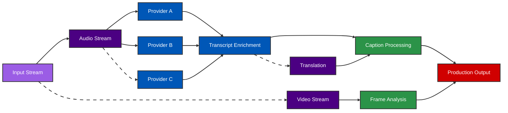

# echoAI

## Low Latency Real-Time Transcription For Live Events

&nbsp;

<v-click>

## Problem

- Live captioning has 15-20+ second delays
- Fans miss critical moments
- Accuracy suffers with domain terminology
- ADA requirements unmet

</v-click>

<v-click>

## Solution

- **750ms latency** - 20x faster than industry
- High accuracy at unprecedented speed
- Native pro audio/video integration
- Extensible plugin architecture

</v-click>

GauntletAI Demo Day Pitch

---
layout: default
class: text-white
---

# Market Validation

In just 2 weeks:

  
- **NBA**: Massive alignment, excited about partnership

- **Twitch**: Exploring integration for creators

- **Assist**: Pending partnership for livestreaming creators

- **MLBAM**: Best-in-class sports tech (upcoming conversation)

Each conversation generates 2+ additional leads and investor introductions

---
layout: default
class: text-white
---

# Market Opportunity

## Sports Entertainment

- $X billion market
- All major leagues seeking improved fan experience
- Long tail of smaller leagues = massive market
- First mover advantage in high-value segment

## Conferences & Events

- $Y billion market
- Live captioning for accessibility compliance
- Multilingual capabilities expand reach
- ADA/FCC regulations increasingly enforced

---
layout: default
class: text-white
---

# Technical Differentiation

High-frequency trading inspired architecture creates **defensible technical moat**

- **Speed**: 750ms vs industry 15-20+ seconds
- **Accuracy**: Context-aware AI for domain terms
- **Redundancy**: Parallel processing with multiple providers
- **Flexibility**: Dynamic plugins without restart

- EOY target: 750ms for end-to-end captioning
- Native integration with professional workflows
- Technical barriers to entry create defensible moat
- Legacy vendors can't adapt quickly enough

<!-- @note PRACTICE REQUIRED 
conenction betwen HFT and Transcription needs to be more clear -->

---
layout: default
class: text-white
---

# Founding Team

  

    
    

      <h3 class="mb-1">Brett &mdash; Founder</h3>
      <ul class="text-sm">
        <li>Early Uber Operations leader (5+ years)</li>
        <li>Built global driver systems from scratch</li>
        <li>Senior roles at Lime, Cornershop, GoPuff</li>
        <li>Co-founded Ukraine Defense Fund ($77M year 1)</li>
        <li>Reliable logistics network - Activated & deployed Elon's donated Starlinks</li>
      </ul>
    

  

  

    
    

      <h3 class="mb-1">Will &mdash; Founding Engineer</h3>
      <ul class="text-sm">
        <li>Rising engineering talent</li>
        <li>Top performer at GauntletAI</li>
        <li>Technical lead on parallel processing systems</li>
        <li>Expertise in high-performance message buses</li>
        <li>Trajectory to become Top 1% engineer</li>
      </ul>
    

  

&nbsp;

  <h3 class="mb-2">Strategic Advisors</h3>
  

    

      
Jessica Doyle

      <ul class="text-sm">
        <li>Digital Growth & Marketing Advisor</li>
        <li>Former VP NBA, Twitch, Cameo </li>
      </ul>
    

    

      
Media strategy & M&A advisory

      <ul class="text-sm">
        <li>VP TV & Streaming at NBCUniversal</li>
      </ul>
    

    

      
Seasoned Live Event Executive

      <ul class="text-sm">
        <li>Retired EVP at Pac-12, CBS, ABC (Disney/ESPN)</li>
      </ul>
    

  

---
layout: default
class: text-white
---

# The Ask & Revenue Path

Raising seed round for minimal team expansion, marketing, customer acquisition

## Revenue Streams

- Enterprise captioning & translation
- Plugin marketplace licensing fees
- Data analytics & insights platform

## Unit Economics

- UE positive from day 1
- Near-negligible COGS
- Higher margins than typical SaaS

Clear path to <strong>$100 million ARR</strong> in 18 months

  <a href="https://echoai.studio" class="text-xl font-bold">echoai.studio</a>
  

    

      
Live demo streaming on our website

    

    →
    
  

