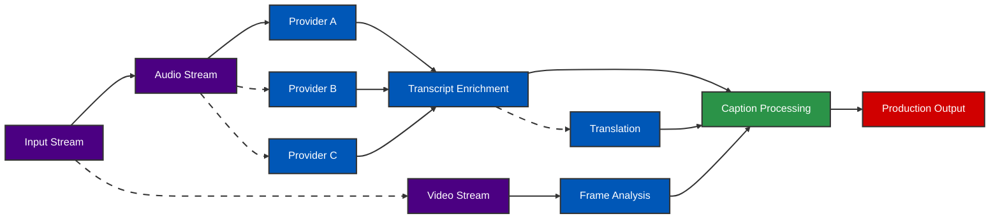

# echoAI

## Low Latency Real-Time Transcription For Live Events

&nbsp;

<v-click>

## Problem

- Fans miss critical moments
- Live captioning has 15-20+ second delay
- Accuracy **-13pp** lower domain terminology
- ADA / FCC regulations unmet

</v-click>

<v-click>

## Solution

- **750ms latency** - 20x faster than industry
- Industry-leading accuracy
- Native pro audio/video workflow integration
- Extensible plugin architecture

</v-click>

GauntletAI Demo Day Pitch

---
layout: default
class: text-white
---

# Market Validation

In just 2 weeks:  
Conversations with stakeholders representing 100s of millions of consumers:

- **NBA**: Translation in multi-languages

- **Twitch**: Zero-effort value add for creators

- **Assist**: Zero-effort value add for viewers

- **MLBAM**: Best-in-class sports tech (upcoming conversation)

Each conversation generates 2+ additional leads and investor introductions

---
layout: default
class: text-white
---

# Market Opportunity

  

    
$80B

    
TAM

  

  

    
$30B

    
SAM

  

  

    
$10B

    
SOM

  

## Media & Broadcasting

- Live captioning & translation for global audiences
- Enhanced viewer engagement & compliance
- **\~$25B** market potential

## Enterprise & Education

- Accessibility for multilingual teams & students
- On-demand analysis & training content
- **\~$5B** market potential

---
layout: default
class: text-white
---

# Technical Differentiation

AI-powered throughout the pipeline combined with AI-first team = <strong>insurmountable moat</strong>

- **Speed**: 750ms vs industry 15-20+ seconds
- **Accuracy**: Context-aware for domain terms
- **Redundancy**: Multiple providers
- **Flexibility**: Dynamic plugins without restart

- EOY target 750ms for e2e captioning
- Native integration with pro workflows
- Technical barriers create defensible moat
- Legacy vendors can't adapt quickly enough

---
layout: default
class: text-white
---

# Founding Team

  

    
    

      <h2 class="mb-1">Brett &mdash; Founder</h2>
      <strong>brett@echoai.studio</strong>
      <ul class="text-base">
        <li>Early Uber leader (pre-uberX, 5 years)</li>
        <li>Built global driver systems: Onboarding, Quality, Engagement</li>
        <li>Senior at Lime, Cornershop, GoPuff</li>
        <li>Co-founded Ukraine NP ($77M year 1)</li>
      </ul>
    

  

  

    
    

      <h2 class="mb-1">Will &mdash; Founding Engineer</h2>
      <strong>will@echoai.studio</strong>
      <ul class="text-base">
        <li>Top performer at GauntletAI</li>
        <li>Trajectory to become Top 1% engineer</li>
        <li>Technical lead on parallel systems</li>
        <li>Expertise in high-performance systems</li>
      </ul>
    

  

&nbsp;

  <h3 class="mb-2">Strategic Advisors</h3>
  

    

      
Jessica Doyle

      <ul class="text-sm">
        <li>Digital Growth & Marketing Advisor</li>
        <li>Former VP NBA, Twitch, Cameo </li>
      </ul>
    

    

      
Unannounced

      <ul class="text-sm">
        <li>Media strategy & M&A advisory</li>
        <li>VP TV & Streaming at NBCUniversal</li>
      </ul>
    

    

      
Unannounced

      <ul class="text-sm">
        <li>Seasoned Live Event Executive</li>
        <li>Retired EVP at Pac-12, CBS, Disney, ESPN</li>
      </ul>
    

  

---
layout: default
class: text-white
---

# The Ask & Revenue Path

Raising seed round for minimal team expansion, marketing, customer acquisition

## Revenue Streams

- Enterprise captioning & translation
- Licensing fees from plugin marketplace
- Subscription-Based Analytics
- Data brokering

## Unit Economics

- UE positive from day one
- Superior Gross Margins
- Optimized Cost Structure
- Scalable Cash Flow Engine

Clear path to <strong>$100 million ARR</strong> in 18 months

  <a href="https://echoai.studio" class="text-xl font-bold">echoai.studio</a>
  

    <!-- 

      
Live demo streaming on our website

    

    → -->
    
  

