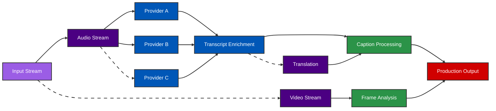

# EchoAI: Real-time Live Audio Transcription

Ultra-fast audio transcription in **750ms**

GauntletAI Demo Day Pitch

---

# The Problem

- Live transcription has unbearable delays (15-20+ seconds)
- Accuracy plummets when trying to go faster
- Professional workflows break with existing solutions
- Sports & entertainment fans miss critical moments
- Accessibility requirements unmet by current tech

---

# Our Solution

EchoAI delivers ultra-fast audio transcription with just **750ms latency** - making real-time interaction possible.

- 10x faster than industry standard
- Maintains high accuracy despite speed
- Native integration with pro audio/video workflows
- Extensible plugin architecture
- EOY target: 750ms for end-to-end captioning

---

# How It Works

- High-frequency trading inspired message bus
- Parallel processing with intelligent load balancing
- Context-aware AI for improved accuracy
- Bespoke infrastructure modeled after financial systems
- Aggregation of multiple providers for redundancy

---

# Traction & Validation

In just 2 weeks:

- **NBA**: Massive alignment, excited about partnership
- **LiveNation**: Eager to implement across venues
- **Twitch**: Exploring integration for creators
- **MLBAM**: Upcoming conversation (best-in-class sports tech)
- **Assist**: Pending partnership for livestreaming creators

Each conversation generates 2+ additional leads and investor introductions

---

# Market Opportunity

[Market size funnel chart: TAM → SAM → SOM]

## Sports Entertainment
- $X billion market
- All leagues seeking improved fan experiences
- Long tail of smaller leagues = massive market

## Conferences & Events
- $Y billion market
- Live captioning for accessibility compliance
- Multilingual capabilities expand reach

---

# Business Model

- Enterprise subscription & usage-based pricing
- Exceptional unit economics:
  - UE positive from day 1
  - Near-negligible COGS
  - Higher margins than typical SaaS

[Pricing tiers and margin visualization]

---

# Competitive Advantage

[2x2 matrix positioning EchoAI vs competitors]

- **Speed**: 750ms vs industry 2-5+ seconds
- **Accuracy**: Context-aware AI outperforms generic solutions
- **Integrations**: Native professional workflow compatibility
- **Plugin Framework**: No restart required, parallel processing

---
layout: two-cols
---

# Our Team

::right::

## Brett (CEO)
- Early Uber Operations leader
- Built global driver systems from scratch
- Senior roles at Lime, Cornershop, GoPuff
- Co-founded Ukraine Defense Fund ($77M in year 1)

## Will (CTO)
- Rising engineering talent
- Top performer at GauntletAI
- Trajectory to become Top 1% engineer

## Advisors (Pending)
- VP Digital Growth at NBA
- EVP at Pac-12 Networks
- VP TV & Streaming at NBCUniversal

---

# Roadmap & Vision

[Product roadmap timeline visualization]

## Near-term
- Core transcription service launch
- Enterprise sports & entertainment focus
- Expand plugin ecosystem

## Future
- Interoperable real-time processing standard
- Voice printing & entity recognition
- Video frame analysis & advanced data modeling
- Third-party data brokering

---

# Why Now?

- ADA/FCC regulations increasingly enforced
- AI models finally capable of required speed & accuracy
- Sports leagues prioritizing fan experience innovation
- Legacy captioning vendors can't adapt quickly
- Technical barriers to entry create defensible moat

---

# The Ask

Raising $X million seed round:

[Fund allocation pie chart]

- Core team expansion (engineering focus)
- Marketing & brand awareness
- Customer referral incentives
- Domain-specific model development

Clear path to $Y million ARR in 18 months

---
layout: center
class: text-center
---

# EchoAI

We're building the real-time AI layer that powers the next generation of live media

[Contact/QR code]
