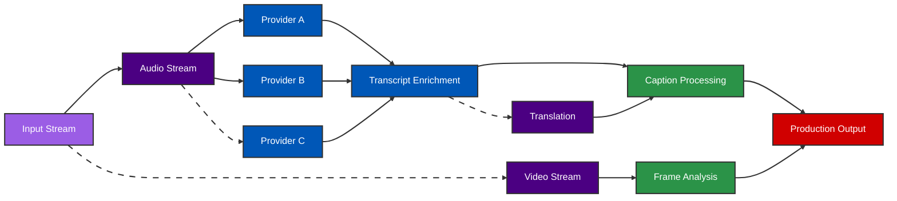

# echoAI

Low Latency Real-Time Transcription For Live Events

GauntletAI Demo Day Pitch

---
layout: default
class: text-white
---

# The Problem

- **Sports & entertainment fans miss critical moments**
<!-- @note: ASH THINKS BIGGEST MOMENT why low latency high accuraacy is required, tell story -->

- Live transcription has unbearable delays (15-20+ seconds)
- Transcriptions are unreliable with domain specific terminology
- Accuracy plummets when trying to go faster
- Accessibility requirements unmet by current tech

---
layout: default
class: text-white
---

# Our Solution

echoAI delivers ultra-fast audio transcription with just **750ms latency** - making real-time interaction possible.

- 20x faster than industry standard
- Maintains high accuracy despite speed
- Native integration with pro audio/video workflows
- Extensible plugin architecture
- EOY target: 750ms for end-to-end captioning

TBW

- Core captioning service launch
- Enterprise sports & entertainment focus
- Expand plugin ecosystem

---
layout: default
class: text-white
---

# How It Works
<!-- PRACTICE REQUIRED 
conenction betwen HFT and Transcription needs to be more clear -->

- High-frequency trading inspired message bus
- Parallel processing with intelligent load balancing
- Context-aware AI for improved accuracy
- Aggregation of multiple providers for redundancy
- Dynamic plug-ins can be reconfigured on the fly

---
layout: default
class: text-white
---

# Traction & Validation

In just 2 weeks:

- **NBA**: Massive alignment, excited about partnership
- **Twitch**: Exploring integration for creators
- **Assist**: Pending partnership for livestreaming creators
- **MLBAM**: Upcoming conversation (best-in-class sports tech)

Each conversation generates 2+ additional leads and offers for investor introductions

## Strategic Advisors

  

    
VP Digital Growth at NBA

    
Digital fan engagement expert

  

  

    
VP TV & Streaming at NBCUniversal

    
Media strategy & M&A advisory

  

  

    
Seasoned Live Event Executive

    
Former EVP at Pac-12, CBS, ABC (Disney / ESPN)

  

---
layout: default
class: text-white
---

# Market Opportunity

[Market size funnel chart: TAM → SAM → SOM]

&nbsp;

&nbsp;

&nbsp;

&nbsp;

## Sports Entertainment

- $X billion market
- All leagues seeking improved fan experiences
- Long tail of smaller leagues = massive market

## Conferences & Events

- $Y billion market
- Live captioning for accessibility compliance
- Multilingual capabilities expand reach

---
layout: default
class: text-white
---

# Business Model

- Enterprise subscription & usage-based pricing
- Exceptional unit economics:
  - UE positive from day 1
  - Near-negligible COGS
  - Higher margins than typical SaaS

<!-- [Pricing tiers and margin visualization] -->

---
layout: default
class: text-white
---

# Competitive Advantage

[2x2 matrix positioning echoAI vs competitors]

- **Speed**: 750ms vs industry 15-20+ seconds
- **Accuracy**: Context-aware AI outperforms generic solutions
- **Integrations**: Native professional workflow compatibility
- **Plugin Framework**: No restart required, parallel processing
- **AI-First Team**: Cracked AI Engineers operate at 20x speed

---
layout: two-cols
class: text-white
---

# Founding Team

  

## Brett (Founder)

- Early Uber Operations leader (5+ years)
- Built global driver systems from scratch
- Senior roles at Lime, Cornershop, GoPuff
- Co-founded Ukraine Defense Fund ($77M year 1)
- Reliable logistics network - Activated & deployed Elon's donated Starlinks

::right::

&nbsp;

  

## Will (Founding Engineer)

- Rising engineering talent
- Top performer at GauntletAI
- Technical lead on parallel processing systems
- Expertise in high-performance message buses
- Trajectory to become Top 1% engineer

---
layout: default
class: text-white
---

# Why Now?

- AI models finally capable of required speed & accuracy
- Sports leagues prioritizing fan experience innovation
- Legacy captioning vendors can't adapt quickly
- Technical barriers to entry create defensible moat
- ADA/FCC regulations increasingly enforced

---
layout: default
class: text-white
---

# The Ask

Raising seed round:

- Minimal team expansion (1x engineering & 1x enterprise sales)
- Marketing & brand awareness
- Customer referral incentives
- Domain-specific model development

## Revenue Streams

- Enterprise audio captioning & translation services
- Plugin marketplace licensing fees
- Data analytics & real-time insights platform

Clear path to $100 million ARR in 18 months

---
layout: center
class: text-center text-white
---

# echoAI

We're building the real-time AI layer that powers the next generation of live media

&nbsp;

  <a href="https://echoai.studio" class="text-3xl font-bold">echoai.studio</a>

  

